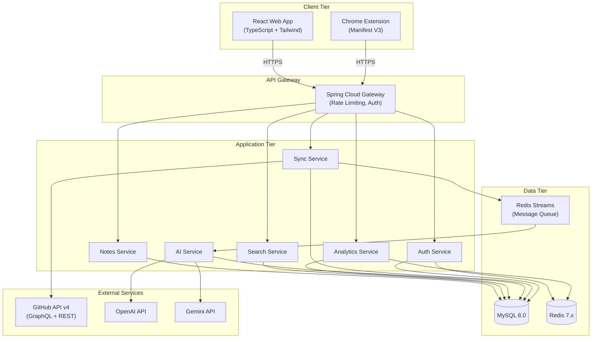

# 4. System Architecture

[← Back to Table of Contents](./00_table_of_contents.md)

---

## 4.1 High-Level Architecture



## 4.2 Architecture Style

The system follows a **modular monolith** architecture for the initial release, with clear module boundaries that allow extraction into microservices as scale demands. This balances startup velocity with future scalability.

| Decision | Choice | Rationale |
|----------|--------|-----------|
| Architecture Style | Modular Monolith | Faster initial development, single deployment unit, easy debugging |
| Communication (internal) | Direct method calls | No network overhead in monolith |
| Communication (extension↔backend) | REST over HTTPS | Universal browser support |
| Async Processing | Redis Streams | Lightweight, already in stack for caching |
| API Protocol | REST + JSON | Simplicity, broad tooling support |

### Why Modular Monolith over Microservices?

```
Modular Monolith Advantages (for a startup):
┌──────────────────────────────────────────────────┐
│ ✅ Single deployment unit → simpler DevOps       │
│ ✅ No network calls between modules → lower      │
│    latency                                        │
│ ✅ Shared database → no distributed transactions  │
│ ✅ Easier debugging → single process              │
│ ✅ Lower infrastructure cost                      │
│ ✅ Can extract to microservices later              │
└──────────────────────────────────────────────────┘

Clear Module Boundaries Enable Future Extraction:
┌─────────┐   ┌─────────┐   ┌─────────┐
│  Auth   │   │  Sync   │   │   AI    │
│ Module  │   │ Module  │   │ Module  │
│         │   │         │   │         │
│ ─ ─ ─ ─│   │ ─ ─ ─ ─│   │ ─ ─ ─ ─│
│  DTOs   │   │  DTOs   │   │  DTOs   │
│  Repo   │   │  Repo   │   │  Repo   │
│  Svc    │   │  Svc    │   │  Svc    │
│  Ctrl   │   │  Ctrl   │   │  Ctrl   │
└─────────┘   └─────────┘   └─────────┘
     ↕              ↕              ↕
     Direct Method Calls (today)
     ────────────────────────────
     REST/gRPC Calls (tomorrow)
```

## 4.3 Technology Stack Summary

| Layer | Technology | Version | Justification |
|-------|------------|---------|---------------|
| Extension | Chrome Manifest V3 | MV3 | Required by Chrome Web Store (MV2 deprecated) |
| Frontend | React + TypeScript | React 18, TS 5.x | Type safety, ecosystem maturity |
| Styling | Tailwind CSS | 3.x | Utility-first, rapid iteration |
| Backend | Java + Spring Boot | Java 21, Spring Boot 3.3 | Enterprise-grade, massive ecosystem |
| Database | MySQL | 8.0 | ACID compliance, JSON column support, mature tooling |
| Cache | Redis | 7.x | Sub-ms reads, pub/sub, streams |
| AI | OpenAI + Gemini | GPT-4o / Gemini 2.0 | Best-in-class code understanding |
| Auth | JWT + GitHub OAuth | OAuth 2.0 | Industry standard |
| CI/CD | GitHub Actions | N/A | Native GitHub integration |
| Containerization | Docker | 24.x | Reproducible builds |
| Cloud | AWS (ECS/RDS/ElastiCache) | N/A | Scalability, managed services |

## 4.4 Layered Architecture (Backend)

```
┌──────────────────────────────────────────────────────┐
│                   Controller Layer                    │
│   REST endpoints, request validation, response DTOs  │
├──────────────────────────────────────────────────────┤
│                    Service Layer                      │
│   Business logic, orchestration, transaction mgmt    │
├──────────────────────────────────────────────────────┤
│                  Repository Layer                     │
│   JPA repositories, custom queries, data access      │
├──────────────────────────────────────────────────────┤
│                    Model Layer                        │
│   JPA entities, enums, value objects                  │
├──────────────────────────────────────────────────────┤
│                   Common Layer                        │
│   Security, config, exceptions, DTOs, utilities      │
└──────────────────────────────────────────────────────┘
```

**Dependency Rule:** Each layer depends only on the layer directly below it. The Controller layer never accesses the Repository layer directly.

---

[← Previous: Non-Functional Requirements](./03_non_functional_requirements.md) | [Next: Component Diagram →](./05_component_diagram.md)
