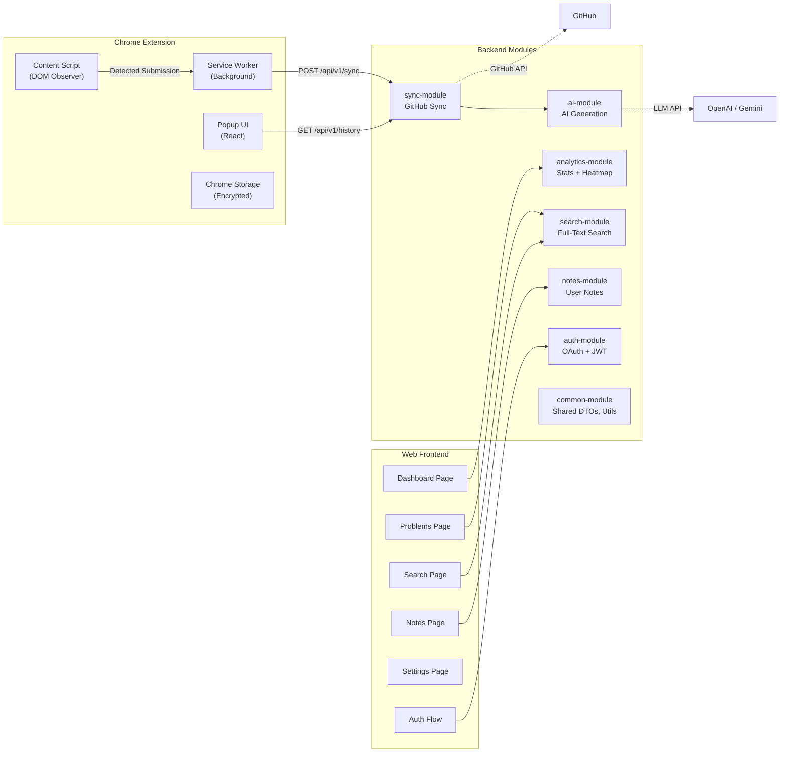
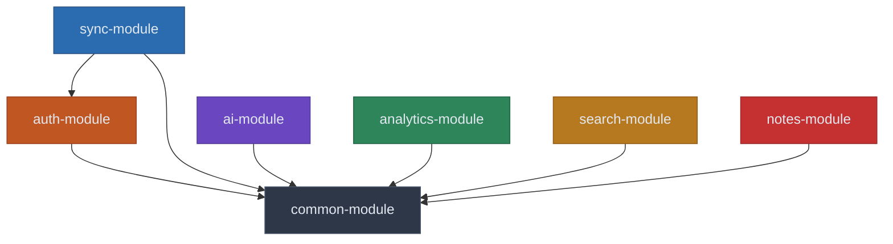

# 5. Component Diagram

[← Back to Table of Contents](./00_table_of_contents.md)

---

## 5.1 Full Component View

## 5.2 Component Descriptions

### Chrome Extension Components

| Component | Responsibility | Key Interfaces | Technology |
|-----------|---------------|----------------|------------|
| **Content Script** | Injects into LeetCode pages. Observes DOM mutations and XHR responses to detect accepted submissions. Extracts problem metadata and solution code. | `chrome.runtime.sendMessage` to Service Worker | TypeScript, MutationObserver API |
| **Service Worker** | Long-lived background process (MV3). Manages auth tokens, queues submissions, communicates with backend API. Handles offline queuing via IndexedDB. | REST calls to backend, `chrome.storage` for persistence | TypeScript, Fetch API |
| **Popup UI** | React-based popup. Displays sync status, recent history, quick settings. Entry point for login flow. | Communicates with Service Worker via `chrome.runtime` | React, TypeScript |
| **Chrome Storage** | Encrypted token storage using `chrome.storage.session` (cleared on browser close) and `chrome.storage.local` (persistent settings). | `chrome.storage.session.get/set` | Chrome Storage API |

### Web Frontend Components

| Component | Responsibility | Key Interfaces |
|-----------|---------------|----------------|
| **Dashboard Page** | Main landing page showing stats cards, heatmap, streak counter, language charts, and topic radar. | `GET /analytics/*` |
| **Problems Page** | Paginated list of all solved problems with filtering and sorting. Drill-down to problem detail with AI explanation. | `GET /problems`, `GET /problems/{id}` |
| **Search Page** | Full-text search with faceted filters for difficulty, tags, patterns, and data structures. | `GET /search` |
| **Notes Page** | Create, edit, and manage personal notes, mistake logs, and revision reminders. | `POST/GET/PUT/DELETE /notes` |
| **Settings Page** | Configure target repository, preferred language, AI toggle, notification preferences. | `GET/PUT /settings`, `GET/POST /repositories` |
| **Auth Flow** | GitHub OAuth login/logout, token management, protected route wrapper. | `GET/POST /auth/*` |

### Backend Module Components

| Component | Responsibility | Dependencies | Key Interfaces |
|-----------|---------------|-------------|----------------|
| **auth-module** | Handles GitHub OAuth callback, issues/refreshes JWTs, manages user sessions. Stores refresh tokens in Redis. | common-module, Redis, MySQL | `/api/v1/auth/*` endpoints |
| **sync-module** | Orchestrates the full sync pipeline: receives submission data, triggers AI generation, commits to GitHub, records in database. | auth-module, ai-module, common-module, Redis Streams, GitHub API | `/api/v1/sync/*`, publishes to Redis Streams |
| **ai-module** | Consumes sync events from Redis Streams. Calls OpenAI/Gemini APIs with structured prompts. Parses and stores generated explanations. Implements provider fallback. | common-module, OpenAI SDK, Gemini SDK | Redis Stream consumer, `/api/v1/ai/*` |
| **analytics-module** | Aggregates solve data into statistics. Computes streaks, heatmaps, topic distributions. Caches heavily in Redis. | common-module, Redis, MySQL | `/api/v1/analytics/*` |
| **search-module** | Provides full-text search over problems, solutions, and notes. Uses MySQL full-text indexes with optional Elasticsearch upgrade path. | common-module, MySQL | `/api/v1/search/*` |
| **notes-module** | CRUD operations for user notes, mistake logs, revision reminders. Supports markdown content. | common-module, MySQL | `/api/v1/notes/*` |
| **common-module** | Shared DTOs, exception handling, validation, utility classes. Security filters, JWT provider, encryption service. | Spring Security, Jackson | Java packages imported by other modules |

## 5.3 Module Dependency Graph

> **Design Principle:** All modules depend on `common-module` but never on each other (except `sync-module → auth-module` for user context). Inter-module communication for async operations uses Redis Streams events, not direct method calls, to maintain loose coupling.

---

[← Previous: System Architecture](./04_system_architecture.md) | [Next: Data Flow Diagram →](./06_data_flow_diagram.md)
