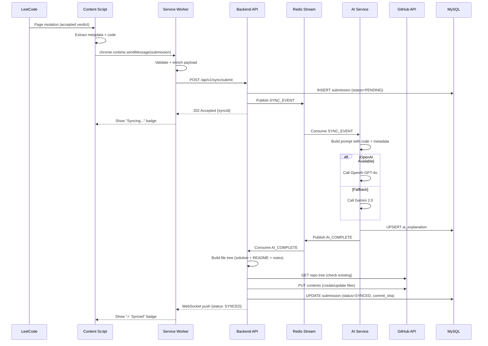
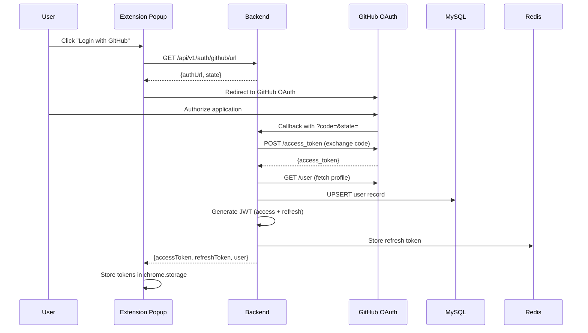
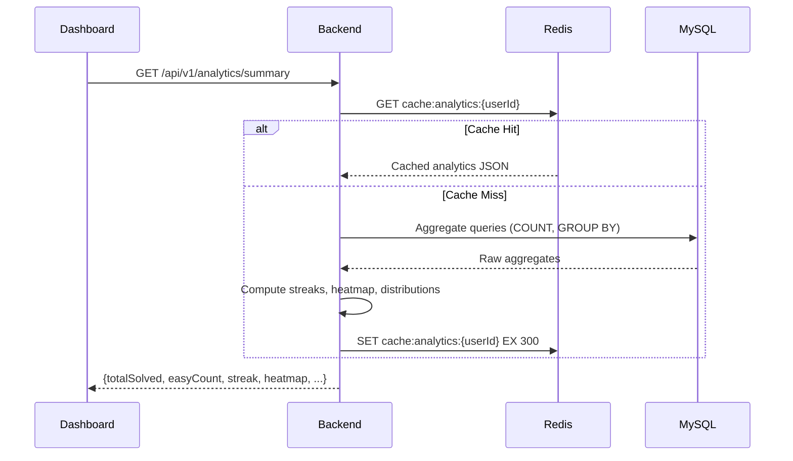
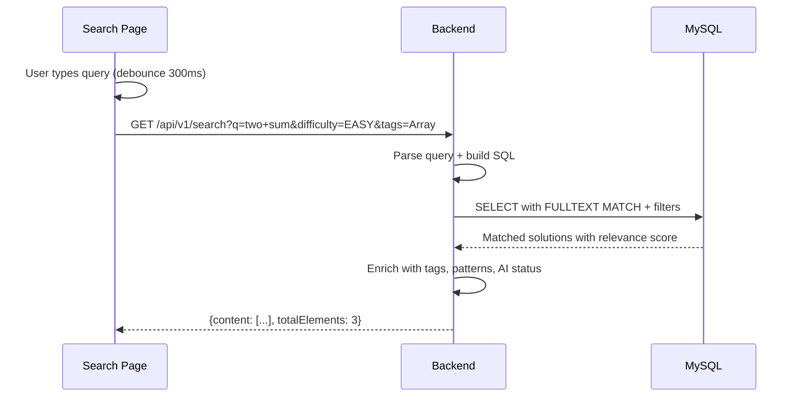
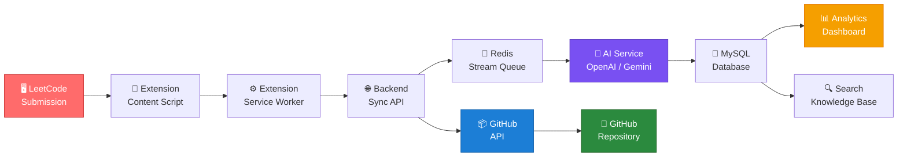

# 6. Data Flow Diagram

[← Back to Table of Contents](./00_table_of_contents.md)

---

## 6.1 Primary Flow — Submission Sync

This is the core workflow of the entire system: detecting a LeetCode submission, processing it through AI, and pushing to GitHub.

### Step-by-Step Breakdown

| Step | Component | Action | Details |
|------|-----------|--------|---------|
| 1 | Content Script | Detect accepted submission | MutationObserver watches for verdict DOM element; XHR interceptor catches submission response |
| 2 | Content Script | Extract metadata | Scrapes: title, difficulty, tags, runtime, memory, language, code from DOM |
| 3 | Service Worker | Validate & enqueue | Validates required fields, adds timestamp, checks for duplicates |
| 4 | Backend API | Persist submission | INSERT into `solutions` table with `status=PENDING` |
| 5 | Backend API | Publish event | Publish `SYNC_EVENT` to Redis Stream for async processing |
| 6 | AI Service | Generate explanation | Builds structured prompt, calls LLM, parses response |
| 7 | AI Service | Store explanation | UPSERT into `ai_explanations` table |
| 8 | Sync Service | Build file tree | Creates `solution.java`, `README.md` (from AI), `notes.md` (template) |
| 9 | Sync Service | Push to GitHub | Uses GitHub Contents API to create/update files |
| 10 | Sync Service | Update status | Marks solution as `SYNCED` with commit SHA |
| 11 | Backend | Notify client | WebSocket push to extension with sync completion status |

## 6.2 Authentication Flow

### OAuth Security Measures

| Measure | Implementation |
|---------|---------------|
| **State Parameter** | Cryptographic random string to prevent CSRF |
| **PKCE** | Code challenge/verifier for authorization code interception prevention |
| **Minimal Scopes** | `repo` (for file access) + `user:email` (for profile) only |
| **Token Encryption** | GitHub access token encrypted with AES-256-GCM before database storage |
| **Session Storage** | JWT stored in `chrome.storage.session` (cleared on browser close) |

## 6.3 Analytics Query Flow

### Cache Invalidation Strategy

| Event | Invalidated Caches |
|-------|-------------------|
| New solution synced | `analytics:summary`, `analytics:heatmap`, `analytics:languages`, `analytics:topics` |
| Solution updated | `analytics:summary`, `analytics:topics` |
| Note created/updated | None (notes not cached) |
| User settings changed | `user:profile` |

## 6.4 Search Flow

## 6.5 Complete System Data Flow (Overview)

---

[← Previous: Component Diagram](./05_component_diagram.md) | [Next: Database Design →](./07_database_design.md)
