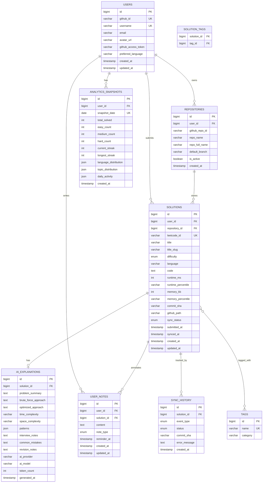

# 7. Database Design

[← Back to Table of Contents](./00_table_of_contents.md)

---

## 7.1 Entity-Relationship Diagram



## 7.2 Table Definitions

### `users`

| Column | Type | Constraints | Description |
|--------|------|-------------|-------------|
| `id` | BIGINT | PK, AUTO_INCREMENT | Internal user ID |
| `github_id` | VARCHAR(50) | UNIQUE, NOT NULL | GitHub user ID |
| `username` | VARCHAR(100) | UNIQUE, NOT NULL | GitHub username |
| `email` | VARCHAR(255) | | User email |
| `avatar_url` | VARCHAR(500) | | GitHub avatar |
| `github_access_token` | VARCHAR(500) | NOT NULL | Encrypted GitHub PAT |
| `preferred_language` | VARCHAR(20) | DEFAULT 'java' | Default coding language |
| `created_at` | TIMESTAMP | DEFAULT CURRENT_TIMESTAMP | |
| `updated_at` | TIMESTAMP | ON UPDATE CURRENT_TIMESTAMP | |

```sql
CREATE TABLE users (
    id BIGINT AUTO_INCREMENT PRIMARY KEY,
    github_id VARCHAR(50) NOT NULL UNIQUE,
    username VARCHAR(100) NOT NULL UNIQUE,
    email VARCHAR(255),
    avatar_url VARCHAR(500),
    github_access_token VARCHAR(500) NOT NULL,
    preferred_language VARCHAR(20) DEFAULT 'java',
    created_at TIMESTAMP DEFAULT CURRENT_TIMESTAMP,
    updated_at TIMESTAMP DEFAULT CURRENT_TIMESTAMP ON UPDATE CURRENT_TIMESTAMP
) ENGINE=InnoDB DEFAULT CHARSET=utf8mb4 COLLATE=utf8mb4_unicode_ci;
```

---

### `repositories`

| Column | Type | Constraints | Description |
|--------|------|-------------|-------------|
| `id` | BIGINT | PK, AUTO_INCREMENT | |
| `user_id` | BIGINT | FK → users.id, NOT NULL | Owning user |
| `github_repo_id` | VARCHAR(50) | NOT NULL | GitHub repository ID |
| `repo_name` | VARCHAR(200) | NOT NULL | Repository name |
| `repo_full_name` | VARCHAR(300) | NOT NULL | e.g., "johndoe/LeetCode" |
| `default_branch` | VARCHAR(50) | DEFAULT 'main' | Branch to push to |
| `is_active` | BOOLEAN | DEFAULT FALSE | Currently selected repo |
| `created_at` | TIMESTAMP | DEFAULT CURRENT_TIMESTAMP | |

```sql
CREATE TABLE repositories (
    id BIGINT AUTO_INCREMENT PRIMARY KEY,
    user_id BIGINT NOT NULL,
    github_repo_id VARCHAR(50) NOT NULL,
    repo_name VARCHAR(200) NOT NULL,
    repo_full_name VARCHAR(300) NOT NULL,
    default_branch VARCHAR(50) DEFAULT 'main',
    is_active BOOLEAN DEFAULT FALSE,
    created_at TIMESTAMP DEFAULT CURRENT_TIMESTAMP,
    FOREIGN KEY (user_id) REFERENCES users(id) ON DELETE CASCADE,
    UNIQUE KEY uk_user_repo (user_id, github_repo_id)
) ENGINE=InnoDB DEFAULT CHARSET=utf8mb4 COLLATE=utf8mb4_unicode_ci;
```

---

### `solutions`

| Column | Type | Constraints | Description |
|--------|------|-------------|-------------|
| `id` | BIGINT | PK, AUTO_INCREMENT | |
| `user_id` | BIGINT | FK → users.id, NOT NULL | |
| `repository_id` | BIGINT | FK → repositories.id | |
| `leetcode_id` | VARCHAR(20) | NOT NULL | LeetCode problem number |
| `title` | VARCHAR(300) | NOT NULL | Problem title |
| `title_slug` | VARCHAR(300) | NOT NULL | URL-safe slug |
| `difficulty` | ENUM('EASY','MEDIUM','HARD') | NOT NULL | |
| `language` | VARCHAR(30) | NOT NULL | Submission language |
| `code` | MEDIUMTEXT | NOT NULL | Submitted source code |
| `runtime_ms` | INT | | Execution time |
| `runtime_percentile` | VARCHAR(10) | | e.g., "95.2%" |
| `memory_kb` | INT | | Memory usage |
| `memory_percentile` | VARCHAR(10) | | e.g., "87.1%" |
| `commit_sha` | VARCHAR(40) | | GitHub commit hash |
| `github_path` | VARCHAR(500) | | Path in repo |
| `sync_status` | ENUM('PENDING','SYNCING','SYNCED','FAILED') | DEFAULT 'PENDING' | |
| `submitted_at` | TIMESTAMP | NOT NULL | LeetCode submission time |
| `synced_at` | TIMESTAMP | | When synced to GitHub |
| `created_at` | TIMESTAMP | DEFAULT CURRENT_TIMESTAMP | |
| `updated_at` | TIMESTAMP | ON UPDATE CURRENT_TIMESTAMP | |

```sql
CREATE TABLE solutions (
    id BIGINT AUTO_INCREMENT PRIMARY KEY,
    user_id BIGINT NOT NULL,
    repository_id BIGINT,
    leetcode_id VARCHAR(20) NOT NULL,
    title VARCHAR(300) NOT NULL,
    title_slug VARCHAR(300) NOT NULL,
    difficulty ENUM('EASY', 'MEDIUM', 'HARD') NOT NULL,
    language VARCHAR(30) NOT NULL,
    code MEDIUMTEXT NOT NULL,
    runtime_ms INT,
    runtime_percentile VARCHAR(10),
    memory_kb INT,
    memory_percentile VARCHAR(10),
    commit_sha VARCHAR(40),
    github_path VARCHAR(500),
    sync_status ENUM('PENDING', 'SYNCING', 'SYNCED', 'FAILED') DEFAULT 'PENDING',
    submitted_at TIMESTAMP NOT NULL,
    synced_at TIMESTAMP NULL,
    created_at TIMESTAMP DEFAULT CURRENT_TIMESTAMP,
    updated_at TIMESTAMP DEFAULT CURRENT_TIMESTAMP ON UPDATE CURRENT_TIMESTAMP,
    FOREIGN KEY (user_id) REFERENCES users(id) ON DELETE CASCADE,
    FOREIGN KEY (repository_id) REFERENCES repositories(id) ON DELETE SET NULL
) ENGINE=InnoDB DEFAULT CHARSET=utf8mb4 COLLATE=utf8mb4_unicode_ci;

-- Indexes
CREATE INDEX idx_solutions_user_id ON solutions(user_id);
CREATE INDEX idx_solutions_difficulty ON solutions(user_id, difficulty);
CREATE INDEX idx_solutions_sync_status ON solutions(sync_status);
CREATE INDEX idx_solutions_submitted_at ON solutions(user_id, submitted_at);
CREATE UNIQUE INDEX idx_solutions_user_leetcode ON solutions(user_id, leetcode_id, language);
CREATE FULLTEXT INDEX idx_solutions_search ON solutions(title, title_slug);
```

---

### `ai_explanations`

| Column | Type | Constraints | Description |
|--------|------|-------------|-------------|
| `id` | BIGINT | PK, AUTO_INCREMENT | |
| `solution_id` | BIGINT | FK → solutions.id, UNIQUE | One explanation per solution |
| `problem_summary` | TEXT | | AI-generated summary |
| `brute_force_approach` | TEXT | | Naive approach description |
| `optimized_approach` | TEXT | | Optimal approach description |
| `time_complexity` | VARCHAR(50) | | e.g., "O(n log n)" |
| `space_complexity` | VARCHAR(50) | | e.g., "O(n)" |
| `patterns` | JSON | | Identified patterns array |
| `interview_notes` | TEXT | | Interview-focused notes |
| `common_mistakes` | TEXT | | Common pitfalls |
| `revision_notes` | TEXT | | Spaced-repetition summary |
| `ai_provider` | VARCHAR(20) | | "openai" or "gemini" |
| `ai_model` | VARCHAR(50) | | e.g., "gpt-4o" |
| `token_count` | INT | | Tokens consumed |
| `generated_at` | TIMESTAMP | | |

```sql
CREATE TABLE ai_explanations (
    id BIGINT AUTO_INCREMENT PRIMARY KEY,
    solution_id BIGINT NOT NULL UNIQUE,
    problem_summary TEXT,
    brute_force_approach TEXT,
    optimized_approach TEXT,
    time_complexity VARCHAR(50),
    space_complexity VARCHAR(50),
    patterns JSON,
    interview_notes TEXT,
    common_mistakes TEXT,
    revision_notes TEXT,
    ai_provider VARCHAR(20),
    ai_model VARCHAR(50),
    token_count INT,
    generated_at TIMESTAMP DEFAULT CURRENT_TIMESTAMP,
    FOREIGN KEY (solution_id) REFERENCES solutions(id) ON DELETE CASCADE
) ENGINE=InnoDB DEFAULT CHARSET=utf8mb4 COLLATE=utf8mb4_unicode_ci;
```

---

### `tags`

| Column | Type | Constraints | Description |
|--------|------|-------------|-------------|
| `id` | BIGINT | PK, AUTO_INCREMENT | |
| `name` | VARCHAR(100) | UNIQUE, NOT NULL | Tag name (e.g., "Array") |
| `category` | VARCHAR(50) | | "data_structure" or "algorithm" |

```sql
CREATE TABLE tags (
    id BIGINT AUTO_INCREMENT PRIMARY KEY,
    name VARCHAR(100) NOT NULL UNIQUE,
    category VARCHAR(50),
    created_at TIMESTAMP DEFAULT CURRENT_TIMESTAMP
) ENGINE=InnoDB DEFAULT CHARSET=utf8mb4 COLLATE=utf8mb4_unicode_ci;
```

---

### `solution_tags` (Join Table)

```sql
CREATE TABLE solution_tags (
    solution_id BIGINT NOT NULL,
    tag_id BIGINT NOT NULL,
    PRIMARY KEY (solution_id, tag_id),
    FOREIGN KEY (solution_id) REFERENCES solutions(id) ON DELETE CASCADE,
    FOREIGN KEY (tag_id) REFERENCES tags(id) ON DELETE CASCADE
) ENGINE=InnoDB DEFAULT CHARSET=utf8mb4 COLLATE=utf8mb4_unicode_ci;

CREATE INDEX idx_solution_tags_tag ON solution_tags(tag_id);
```

---

### `user_notes`

| Column | Type | Constraints | Description |
|--------|------|-------------|-------------|
| `id` | BIGINT | PK, AUTO_INCREMENT | |
| `user_id` | BIGINT | FK → users.id, NOT NULL | |
| `solution_id` | BIGINT | FK → solutions.id | Nullable for general notes |
| `content` | TEXT | NOT NULL | Markdown content |
| `note_type` | ENUM | DEFAULT 'PERSONAL' | PERSONAL, MISTAKE, REVISION, INTERVIEW |
| `reminder_at` | TIMESTAMP | | Revision reminder date |
| `created_at` | TIMESTAMP | DEFAULT CURRENT_TIMESTAMP | |
| `updated_at` | TIMESTAMP | ON UPDATE CURRENT_TIMESTAMP | |

```sql
CREATE TABLE user_notes (
    id BIGINT AUTO_INCREMENT PRIMARY KEY,
    user_id BIGINT NOT NULL,
    solution_id BIGINT,
    content TEXT NOT NULL,
    note_type ENUM('PERSONAL', 'MISTAKE', 'REVISION', 'INTERVIEW') DEFAULT 'PERSONAL',
    reminder_at TIMESTAMP NULL,
    created_at TIMESTAMP DEFAULT CURRENT_TIMESTAMP,
    updated_at TIMESTAMP DEFAULT CURRENT_TIMESTAMP ON UPDATE CURRENT_TIMESTAMP,
    FOREIGN KEY (user_id) REFERENCES users(id) ON DELETE CASCADE,
    FOREIGN KEY (solution_id) REFERENCES solutions(id) ON DELETE SET NULL
) ENGINE=InnoDB DEFAULT CHARSET=utf8mb4 COLLATE=utf8mb4_unicode_ci;

CREATE INDEX idx_user_notes_user ON user_notes(user_id);
CREATE INDEX idx_user_notes_solution ON user_notes(solution_id);
CREATE INDEX idx_user_notes_reminder ON user_notes(user_id, reminder_at);
```

---

### `analytics_snapshots`

| Column | Type | Constraints | Description |
|--------|------|-------------|-------------|
| `id` | BIGINT | PK, AUTO_INCREMENT | |
| `user_id` | BIGINT | FK → users.id, NOT NULL | |
| `snapshot_date` | DATE | NOT NULL | Date of snapshot |
| `total_solved` | INT | DEFAULT 0 | |
| `easy_count` | INT | DEFAULT 0 | |
| `medium_count` | INT | DEFAULT 0 | |
| `hard_count` | INT | DEFAULT 0 | |
| `current_streak` | INT | DEFAULT 0 | |
| `longest_streak` | INT | DEFAULT 0 | |
| `language_distribution` | JSON | | Language breakdown |
| `topic_distribution` | JSON | | Topic breakdown |
| `daily_activity` | JSON | | Day-level activity |
| `created_at` | TIMESTAMP | DEFAULT CURRENT_TIMESTAMP | |

```sql
CREATE TABLE analytics_snapshots (
    id BIGINT AUTO_INCREMENT PRIMARY KEY,
    user_id BIGINT NOT NULL,
    snapshot_date DATE NOT NULL,
    total_solved INT DEFAULT 0,
    easy_count INT DEFAULT 0,
    medium_count INT DEFAULT 0,
    hard_count INT DEFAULT 0,
    current_streak INT DEFAULT 0,
    longest_streak INT DEFAULT 0,
    language_distribution JSON,
    topic_distribution JSON,
    daily_activity JSON,
    created_at TIMESTAMP DEFAULT CURRENT_TIMESTAMP,
    FOREIGN KEY (user_id) REFERENCES users(id) ON DELETE CASCADE,
    UNIQUE KEY uk_user_date (user_id, snapshot_date)
) ENGINE=InnoDB DEFAULT CHARSET=utf8mb4 COLLATE=utf8mb4_unicode_ci;
```

---

### `sync_history`

| Column | Type | Constraints | Description |
|--------|------|-------------|-------------|
| `id` | BIGINT | PK, AUTO_INCREMENT | |
| `solution_id` | BIGINT | FK → solutions.id, NOT NULL | |
| `event_type` | ENUM | NOT NULL | CREATED, UPDATED, AI_GENERATED, SYNCED, FAILED |
| `status` | ENUM | NOT NULL | SUCCESS, FAILURE |
| `commit_sha` | VARCHAR(40) | | GitHub commit hash |
| `error_message` | TEXT | | Error details on failure |
| `created_at` | TIMESTAMP | DEFAULT CURRENT_TIMESTAMP | |

```sql
CREATE TABLE sync_history (
    id BIGINT AUTO_INCREMENT PRIMARY KEY,
    solution_id BIGINT NOT NULL,
    event_type ENUM('CREATED', 'UPDATED', 'AI_GENERATED', 'SYNCED', 'FAILED') NOT NULL,
    status ENUM('SUCCESS', 'FAILURE') NOT NULL,
    commit_sha VARCHAR(40),
    error_message TEXT,
    created_at TIMESTAMP DEFAULT CURRENT_TIMESTAMP,
    FOREIGN KEY (solution_id) REFERENCES solutions(id) ON DELETE CASCADE
) ENGINE=InnoDB DEFAULT CHARSET=utf8mb4 COLLATE=utf8mb4_unicode_ci;

CREATE INDEX idx_sync_history_solution ON sync_history(solution_id);
CREATE INDEX idx_sync_history_created ON sync_history(created_at);
```

## 7.3 Key Relationships

| Relationship | Type | Cardinality | Cascade |
|-------------|------|-------------|---------|
| Users → Repositories | One-to-Many | 1 user : N repos | CASCADE DELETE |
| Users → Solutions | One-to-Many | 1 user : N solutions | CASCADE DELETE |
| Repositories → Solutions | One-to-Many | 1 repo : N solutions | SET NULL on delete |
| Solutions → AI Explanations | One-to-One | 1 solution : 0..1 explanation | CASCADE DELETE |
| Solutions ↔ Tags | Many-to-Many | N solutions : M tags | CASCADE DELETE on join table |
| Solutions → Sync History | One-to-Many | 1 solution : N events | CASCADE DELETE |
| Solutions → User Notes | One-to-Many | 1 solution : N notes | SET NULL |
| Users → Analytics Snapshots | One-to-Many | 1 user : N daily snapshots | CASCADE DELETE |

## 7.4 Database Configuration

```yaml
# application.yml
spring:
  datasource:
    url: jdbc:mysql://localhost:3306/leethub?useSSL=true&serverTimezone=UTC
    driver-class-name: com.mysql.cj.jdbc.Driver
    hikari:
      minimum-idle: 5
      maximum-pool-size: 20
      idle-timeout: 300000
      max-lifetime: 1200000
      connection-timeout: 30000
  jpa:
    hibernate:
      ddl-auto: validate  # Flyway manages schema
    properties:
      hibernate:
        dialect: org.hibernate.dialect.MySQLDialect
        format_sql: true
  flyway:
    enabled: true
    locations: classpath:db/migration
```

---

[← Previous: Data Flow Diagram](./06_data_flow_diagram.md) | [Next: API Design →](./08_api_design.md)
