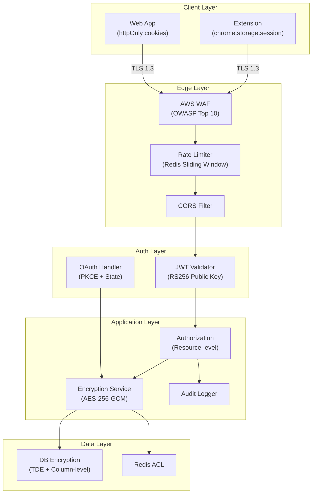
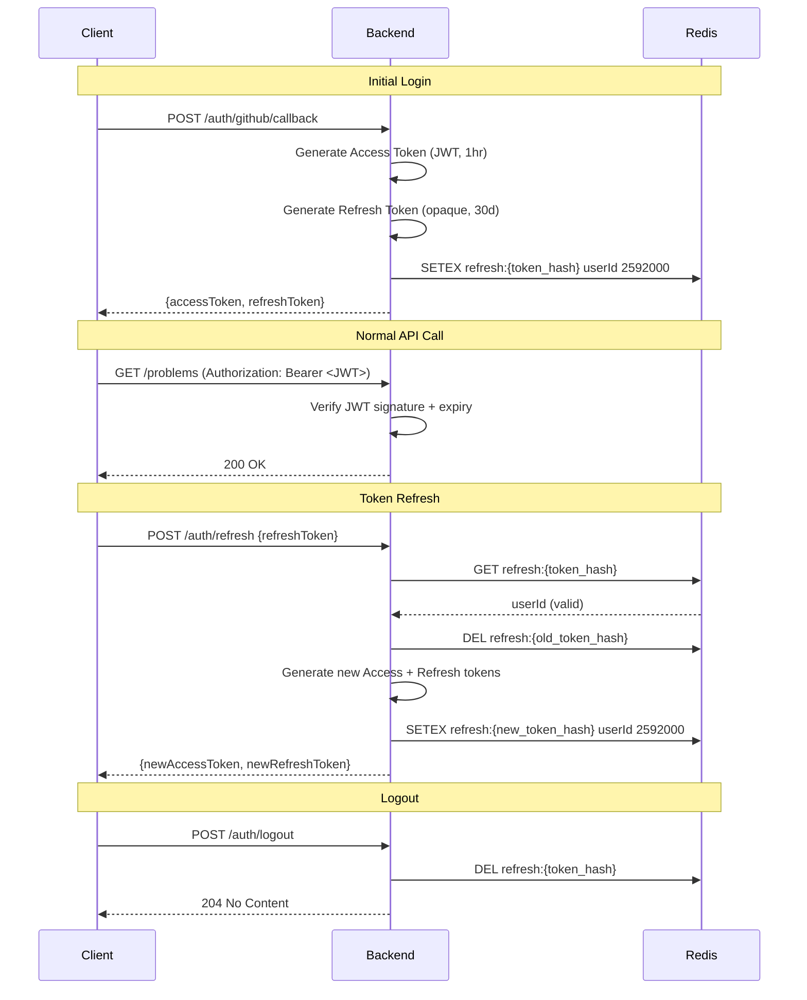

# 9. Security Architecture

[← Back to Table of Contents](./00_table_of_contents.md)

---

## 9.1 Security Architecture Diagram



## 9.2 Authentication Design

### JWT Configuration

| Aspect | Design | Detail |
|--------|--------|--------|
| **Signing Algorithm** | RS256 | Asymmetric — public key for verification, private key for signing |
| **Access Token Lifetime** | 1 hour | Short-lived to limit exposure |
| **Refresh Token Lifetime** | 30 days | Stored server-side in Redis |
| **Token Rotation** | Enabled | Refresh token is single-use; new one issued on refresh |
| **Key Size** | RSA-2048 | Industry standard minimum |
| **Key Rotation** | Every 90 days | Automated via AWS Secrets Manager |

### JWT Claims Structure

```json
{
  "sub": "user_12345",
  "iss": "leethub.ai",
  "aud": "leethub-api",
  "iat": 1719043200,
  "exp": 1719046800,
  "jti": "unique-token-id",
  "roles": ["USER"],
  "github_id": "12345",
  "username": "johndoe"
}
```

### Token Lifecycle



## 9.3 OAuth 2.0 Flow (GitHub)

| Parameter | Value |
|-----------|-------|
| **Provider** | GitHub |
| **Grant Type** | Authorization Code + PKCE |
| **Scopes** | `repo`, `user:email` |
| **Redirect URI** | `https://api.leethub.ai/api/v1/auth/github/callback` |
| **State** | 32-byte cryptographic random (CSRF protection) |
| **PKCE Method** | S256 (SHA-256 code challenge) |

### OAuth Sequence

```
1. Extension generates code_verifier (random 43-128 chars)
2. Extension computes code_challenge = SHA256(code_verifier)
3. Extension opens GitHub OAuth URL with state + code_challenge
4. User authorizes on GitHub
5. GitHub redirects to backend with ?code=&state=
6. Backend verifies state matches stored value
7. Backend exchanges code + code_verifier for access_token
8. Backend fetches user profile from GitHub
9. Backend issues JWT + stores refresh token
10. Tokens returned to extension
```

## 9.4 Token Storage Strategy

| Client | Storage | Security Properties |
|--------|---------|-------------------|
| **Chrome Extension** | `chrome.storage.session` | Encrypted, cleared on browser close, no web page access |
| **Chrome Extension (persistent)** | `chrome.storage.local` (settings only) | Encrypted by Chrome, no sensitive tokens |
| **Web App** | httpOnly + Secure + SameSite=Strict cookies | XSS-proof, CSRF-protected |
| **Backend (GitHub PAT)** | MySQL (AES-256-GCM encrypted column) | Application-level encryption |
| **Backend (Refresh Token)** | Redis (hashed key) | TTL-based expiry, single-use rotation |

## 9.5 Encryption Strategy

| Data | At Rest | In Transit | Key Management |
|------|---------|------------|----------------|
| GitHub Access Tokens | AES-256-GCM (application-level) | TLS 1.3 | AWS Secrets Manager |
| User PII (email) | AES-256-GCM | TLS 1.3 | AWS Secrets Manager |
| Solution Code | Plaintext (user's own code) | TLS 1.3 | N/A |
| JWT Signing Keys | AWS Secrets Manager | N/A | 90-day rotation |
| Database | MySQL TDE (InnoDB tablespace) | TLS 1.3 to RDS | AWS KMS |
| Redis | At-rest encryption (ElastiCache) | TLS to ElastiCache | AWS managed |

### Encryption Service (Java)

```java
@Service
public class EncryptionService {
    
    private final SecretKey secretKey;
    
    public String encrypt(String plaintext) {
        Cipher cipher = Cipher.getInstance("AES/GCM/NoPadding");
        byte[] iv = generateRandomIV(12);
        cipher.init(Cipher.ENCRYPT_MODE, secretKey, new GCMParameterSpec(128, iv));
        byte[] ciphertext = cipher.doFinal(plaintext.getBytes(UTF_8));
        // Prepend IV to ciphertext for storage
        return Base64.encode(concat(iv, ciphertext));
    }
    
    public String decrypt(String encrypted) {
        byte[] data = Base64.decode(encrypted);
        byte[] iv = Arrays.copyOfRange(data, 0, 12);
        byte[] ciphertext = Arrays.copyOfRange(data, 12, data.length);
        Cipher cipher = Cipher.getInstance("AES/GCM/NoPadding");
        cipher.init(Cipher.DECRYPT_MODE, secretKey, new GCMParameterSpec(128, iv));
        return new String(cipher.doFinal(ciphertext), UTF_8);
    }
}
```

## 9.6 Rate Limiting

### Strategy: Redis Sliding Window

```
Algorithm:
  Key:    rate_limit:{user_id}:{endpoint_group}
  Window: 60 seconds (configurable per endpoint)

  1. MULTI
  2. ZADD key CURRENT_TIMESTAMP CURRENT_TIMESTAMP
  3. ZREMRANGEBYSCORE key 0 (CURRENT_TIMESTAMP - WINDOW)
  4. ZCARD key
  5. EXPIRE key WINDOW
  6. EXEC
  
  If ZCARD > LIMIT → return 429 Too Many Requests
```

### Rate Limit Tiers

| Endpoint Group | Limit | Window | Burst |
|---------------|-------|--------|-------|
| Auth (unauthenticated) | 10 | 60s | 5 |
| Sync operations | 30 | 60s | 10 |
| Read operations (CRUD) | 60 | 60s | 20 |
| Search | 60 | 60s | 15 |
| Analytics | 30 | 60s | 10 |
| Global (per IP) | 1000 | 60s | 100 |

### Response Headers

```
HTTP/1.1 429 Too Many Requests
X-RateLimit-Limit: 60
X-RateLimit-Remaining: 0
X-RateLimit-Reset: 1719043260
Retry-After: 45

{
  "status": 429,
  "code": "RATE_LIMIT_EXCEEDED",
  "message": "Rate limit exceeded. Try again in 45 seconds."
}
```

## 9.7 API Security Measures

| Measure | Implementation | Details |
|---------|---------------|---------|
| **Input Validation** | Jakarta Bean Validation | `@NotBlank`, `@Size`, `@Pattern` on all request DTOs |
| **SQL Injection** | JPA/Hibernate | Parameterized queries exclusively; no raw SQL concatenation |
| **XSS Prevention** | React auto-escaping + CSP | Server-side: `Content-Security-Policy` header |
| **CSRF** | SameSite cookies + CSRF tokens | Double-submit cookie pattern for web app |
| **CORS** | Whitelist origins | Only `https://leethub.ai` and extension origin |
| **Content-Type** | Strict validation | Reject non-JSON payloads on API endpoints |
| **Response Headers** | Security headers | `X-Content-Type-Options: nosniff`, `X-Frame-Options: DENY` |
| **Dependency Scanning** | GitHub Dependabot + OWASP | Automated in CI pipeline, blocks on critical CVEs |
| **Secret Management** | AWS Secrets Manager | No secrets in code, env files, or Docker images |
| **Audit Logging** | Structured JSON logs | All auth events, data mutations, and admin actions logged |

### Content Security Policy

```
Content-Security-Policy:
  default-src 'self';
  script-src 'self';
  style-src 'self' 'unsafe-inline' https://fonts.googleapis.com;
  font-src 'self' https://fonts.gstatic.com;
  img-src 'self' https://avatars.githubusercontent.com data:;
  connect-src 'self' https://api.leethub.ai;
  frame-ancestors 'none';
  base-uri 'self';
  form-action 'self';
```

## 9.8 Security Checklist

| Category | Item | Status |
|----------|------|--------|
| **Authentication** | GitHub OAuth 2.0 with PKCE | ☐ Implement |
| **Authentication** | JWT RS256 with key rotation | ☐ Implement |
| **Authentication** | Refresh token rotation (single-use) | ☐ Implement |
| **Authorization** | Resource-level ownership checks | ☐ Implement |
| **Encryption** | AES-256-GCM for sensitive columns | ☐ Implement |
| **Encryption** | TLS 1.3 for all connections | ☐ Configure |
| **Rate Limiting** | Sliding window per user + global per IP | ☐ Implement |
| **Input Validation** | Bean validation on all DTOs | ☐ Implement |
| **Headers** | CSP, X-Frame-Options, HSTS | ☐ Configure |
| **Dependencies** | Dependabot + OWASP scan in CI | ☐ Configure |
| **Secrets** | AWS Secrets Manager for all credentials | ☐ Configure |
| **Audit** | Structured audit logging | ☐ Implement |

---

[← Previous: API Design](./08_api_design.md) | [Next: Scalability Strategy →](./10_scalability_strategy.md)
