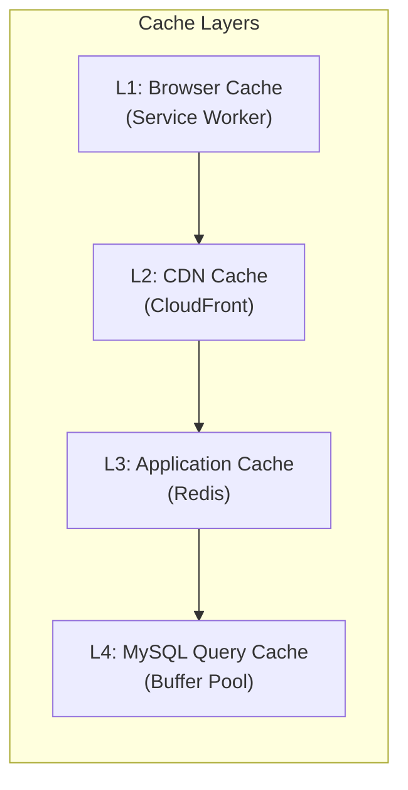
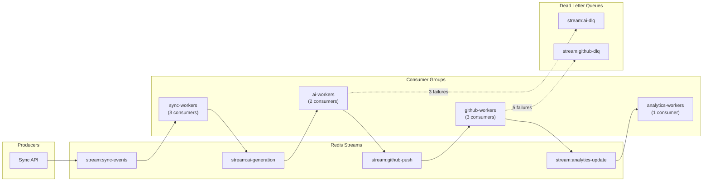
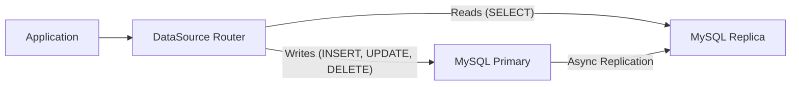

# 10. Scalability Strategy

[← Back to Table of Contents](./00_table_of_contents.md)

---

## 10.1 Caching Architecture



### Cache Targets & TTLs

| Cache Target | TTL | Invalidation Strategy | Estimated Hit Rate |
|-------------|-----|----------------------|-------------------|
| Analytics Summary | 5 min | Event-driven on new sync | 85% |
| Heatmap Data | 1 hour | Daily rebuild | 95% |
| User Profile | 15 min | On profile update | 90% |
| Search Results | 2 min | On new solution | 60% |
| Repository List | 10 min | On repo selection change | 95% |
| Problem Detail | 30 min | On solution update | 80% |

### Redis Key Schema

```
# Pattern: {namespace}:{entity}:{identifier}

cache:analytics:summary:{userId}       → JSON    TTL: 300s
cache:analytics:heatmap:{userId}:{year} → JSON    TTL: 3600s
cache:analytics:languages:{userId}      → JSON    TTL: 300s
cache:analytics:topics:{userId}         → JSON    TTL: 300s
cache:user:profile:{userId}            → JSON    TTL: 900s
cache:repo:active:{userId}            → JSON    TTL: 600s
cache:search:{hash(query+filters)}     → JSON    TTL: 120s

auth:refresh:{tokenHash}              → userId  TTL: 2592000s (30d)
rate_limit:{userId}:{endpoint}         → ZSET    TTL: 60s
```

### Cache-Aside Pattern (Implementation)

```java
@Service
public class AnalyticsService {
    
    private final RedisTemplate<String, String> redis;
    private final SolutionRepository solutionRepo;
    
    public AnalyticsSummary getSummary(Long userId) {
        String key = "cache:analytics:summary:" + userId;
        
        // 1. Check cache
        String cached = redis.opsForValue().get(key);
        if (cached != null) {
            return objectMapper.readValue(cached, AnalyticsSummary.class);
        }
        
        // 2. Query database
        AnalyticsSummary summary = computeSummary(userId);
        
        // 3. Populate cache
        redis.opsForValue().set(key, 
            objectMapper.writeValueAsString(summary), 
            Duration.ofSeconds(300));
        
        return summary;
    }
    
    // Called when new solution is synced
    @EventListener
    public void onSolutionSynced(SolutionSyncedEvent event) {
        Long userId = event.getUserId();
        redis.delete(List.of(
            "cache:analytics:summary:" + userId,
            "cache:analytics:heatmap:" + userId + ":*",
            "cache:analytics:languages:" + userId,
            "cache:analytics:topics:" + userId
        ));
    }
}
```

## 10.2 Async Processing Design

### Redis Streams Pipeline



### Processing Pipeline Stages

| Stage | Stream | Consumers | Timeout | Description |
|-------|--------|-----------|---------|-------------|
| 1. Sync Intake | `stream:sync-events` | 3 | 5s | Validate, deduplicate, persist submission |
| 2. AI Generation | `stream:ai-generation` | 2 | 30s | Call LLM API, parse response, store explanation |
| 3. GitHub Push | `stream:github-push` | 3 | 15s | Build file tree, commit to GitHub |
| 4. Analytics Update | `stream:analytics-update` | 1 | 5s | Invalidate caches, update snapshots |

### Consumer Group Setup

```redis
# Create streams and consumer groups
XGROUP CREATE stream:sync-events sync-workers $ MKSTREAM
XGROUP CREATE stream:ai-generation ai-workers $ MKSTREAM
XGROUP CREATE stream:github-push github-workers $ MKSTREAM
XGROUP CREATE stream:analytics-update analytics-workers $ MKSTREAM
XGROUP CREATE stream:ai-dlq dlq-processors $ MKSTREAM
XGROUP CREATE stream:github-dlq dlq-processors $ MKSTREAM
```

### Retry Policy

| Stage | Max Retries | Backoff Strategy | Dead Letter |
|-------|------------|-----------------|-------------|
| AI Generation | 3 | Exponential (2s, 4s, 8s) | `stream:ai-dlq` |
| GitHub Push | 5 | Exponential (1s, 2s, 4s, 8s, 16s) | `stream:github-dlq` |
| Analytics Update | 3 | Fixed (5s) | `stream:analytics-dlq` |

### Retry Implementation

```java
@Component
public class RetryableStreamConsumer {
    
    private static final int MAX_RETRIES = 3;
    
    public void processWithRetry(StreamMessage message, 
                                  Function<StreamMessage, Void> processor,
                                  String dlqStream) {
        int attempts = 0;
        while (attempts < MAX_RETRIES) {
            try {
                processor.apply(message);
                acknowledgeMessage(message);
                return;
            } catch (Exception e) {
                attempts++;
                if (attempts >= MAX_RETRIES) {
                    // Move to dead letter queue
                    publishToDLQ(dlqStream, message, e);
                    acknowledgeMessage(message);
                    return;
                }
                // Exponential backoff
                Thread.sleep((long) Math.pow(2, attempts) * 1000);
            }
        }
    }
}
```

## 10.3 Queue Design

### Message Schema

```json
// stream:sync-events
{
  "eventId": "evt_abc123",
  "eventType": "SOLUTION_SUBMITTED",
  "userId": 12345,
  "solutionId": 67890,
  "timestamp": "2026-06-22T10:15:30Z",
  "metadata": {
    "leetcodeId": "1",
    "title": "Two Sum",
    "language": "java"
  }
}
```

### Backpressure Handling

| Scenario | Detection | Response |
|----------|-----------|----------|
| Queue depth > 1000 | Redis Stream XLEN monitor | Scale up consumer count |
| Consumer lag > 60s | XPENDING analysis | Alert + auto-scale |
| DLQ depth > 50 | DLQ monitor | Alert ops team |
| Memory > 80% | Redis INFO memory | Trim old stream entries (XTRIM) |

## 10.4 Database Optimization

### Indexing Strategy

```sql
-- Composite indexes for frequent query patterns
CREATE INDEX idx_solutions_user_difficulty ON solutions(user_id, difficulty);
CREATE INDEX idx_solutions_user_submitted ON solutions(user_id, submitted_at DESC);
CREATE INDEX idx_solutions_user_lang ON solutions(user_id, language);
CREATE INDEX idx_solutions_sync ON solutions(sync_status, created_at);

-- Full-text search
CREATE FULLTEXT INDEX idx_solutions_ft ON solutions(title, title_slug);

-- Covering index for analytics
CREATE INDEX idx_solutions_analytics ON solutions(user_id, difficulty, submitted_at, language);
```

### Query Optimization Rules

| Rule | Implementation |
|------|---------------|
| Pagination | Keyset (cursor-based) instead of OFFSET |
| N+1 Prevention | `@EntityGraph` or `JOIN FETCH` in JPA |
| Projection | `SELECT` only needed columns, use DTOs |
| Batch Operations | `@Modifying` bulk updates, batch inserts |
| Explain Analysis | CI gate: reject queries with full table scans |

### Cursor-Based Pagination Example

```java
// Instead of: SELECT ... LIMIT 20 OFFSET 200 (O(n) - slow for large offsets)
// Use: SELECT ... WHERE id > :lastId ORDER BY id ASC LIMIT 20 (O(1))

@Query("""
    SELECT s FROM Solution s 
    WHERE s.userId = :userId 
    AND s.id > :cursor 
    ORDER BY s.id ASC
    """)
List<Solution> findAfterCursor(
    @Param("userId") Long userId,
    @Param("cursor") Long cursor,
    Pageable pageable
);
```

### Connection Pool Configuration

```yaml
spring:
  datasource:
    hikari:
      minimum-idle: 5          # Minimum connections kept alive
      maximum-pool-size: 20    # Max connections per instance
      idle-timeout: 300000     # 5 min idle before release
      max-lifetime: 1200000    # 20 min max connection age
      connection-timeout: 30000 # 30s to acquire connection
      leak-detection-threshold: 60000 # Log leak warning at 60s
```

### Read Replica Strategy



```java
@Configuration
public class DataSourceConfig {
    
    @Bean
    public DataSource routingDataSource() {
        var router = new ReadWriteRoutingDataSource();
        router.setTargetDataSources(Map.of(
            "primary", primaryDataSource(),
            "replica", replicaDataSource()
        ));
        router.setDefaultTargetDataSource(primaryDataSource());
        return router;
    }
}

// Usage: annotate read-only service methods
@Transactional(readOnly = true) // Routes to replica
public List<Solution> searchSolutions(String query) { ... }
```

### Partitioning Strategy (Future)

```sql
-- Range partition by year for solutions table
ALTER TABLE solutions
PARTITION BY RANGE (YEAR(submitted_at)) (
    PARTITION p2025 VALUES LESS THAN (2026),
    PARTITION p2026 VALUES LESS THAN (2027),
    PARTITION p2027 VALUES LESS THAN (2028),
    PARTITION pmax  VALUES LESS THAN MAXVALUE
);
```

## 10.5 Horizontal Scaling Path

```
Phase 1 (0-10K users):
  ┌──────────────────────────────┐
  │  Single Instance (Monolith)  │
  │  1x ECS Task                 │
  │  1x RDS (db.t3.medium)      │
  │  1x Redis (cache.t3.micro)  │
  └──────────────────────────────┘
            ↓
Phase 2 (10K-100K users):
  ┌──────────────────────────────┐
  │  2-3 Instances behind ALB    │
  │  1x Read Replica             │
  │  Redis Cluster Mode          │
  │  Separate AI worker pool     │
  └──────────────────────────────┘
            ↓
Phase 3 (100K+ users):
  ┌──────────────────────────────┐
  │  Extract AI → Service        │
  │  Extract Sync → Service      │
  │  Add Elasticsearch           │
  │  RDS Multi-AZ + 2 Replicas  │
  └──────────────────────────────┘
            ↓
Phase 4 (1M+ users):
  ┌──────────────────────────────┐
  │  Full Microservices          │
  │  Service Mesh (Istio)        │
  │  Database Sharding           │
  │  Multi-Region Deployment     │
  │  Event-Driven Architecture   │
  └──────────────────────────────┘
```

---

[← Previous: Security Architecture](./09_security_architecture.md) | [Next: Development Roadmap →](./11_development_roadmap.md)
