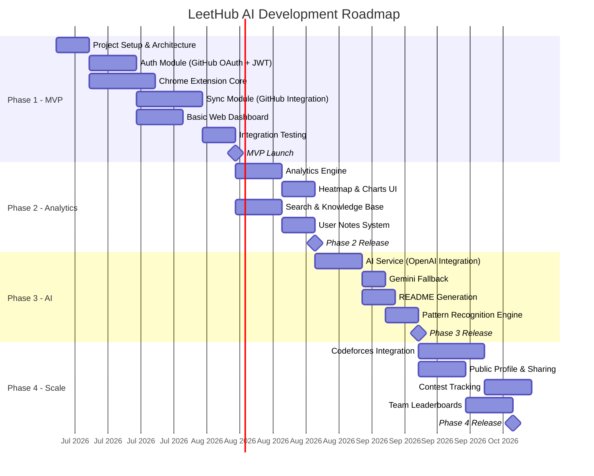

# 11. Development Roadmap

[← Back to Table of Contents](./00_table_of_contents.md)

---

## 11.1 Phase Overview

## 11.2 Phase 1: MVP (Weeks 1–8)

**Goal:** Working end-to-end sync from LeetCode → Extension → Backend → GitHub

| Deliverable | Duration | Dependencies | Team | Definition of Done |
|-------------|----------|--------------|------|-------------------|
| Project scaffolding | 1 week | None | Full Stack | Repos created, CI/CD green, Docker builds, dev environment documented |
| GitHub OAuth + JWT auth | 1.5 weeks | Scaffolding | Backend | Login/logout, token refresh, extension auth, 90%+ test coverage |
| Extension content script | 2 weeks | Scaffolding | Frontend | Detects accepted submissions on LeetCode with ≥ 95% accuracy |
| Extension service worker | 1 week | Content script, Auth | Frontend | Queues submissions, calls backend, handles offline |
| Extension popup UI | 1 week | Service worker | Frontend | Login, sync status, history list |
| Sync module | 2 weeks | Auth | Backend | Files committed to GitHub with correct folder structure |
| Basic dashboard | 1.5 weeks | Auth | Frontend | Login page, problem list, sync status display |
| Integration testing | 1 week | All above | Full Stack | Full E2E flow passes, load test baseline established |

### Phase 1 Milestones

| Week | Milestone | Acceptance Criteria |
|------|-----------|-------------------|
| W2 | Dev environment ready | All services start with `docker-compose up` |
| W4 | Auth complete | Login/logout via GitHub OAuth works from extension |
| W6 | Sync complete | Accepted LeetCode solution appears in GitHub repo |
| W8 | MVP launch | Chrome Web Store submission, 10 beta users |

## 11.3 Phase 2: Analytics & Knowledge (Weeks 9–14)

**Goal:** Rich analytics dashboard and searchable knowledge base

| Deliverable | Duration | Dependencies | Team |
|-------------|----------|--------------|------|
| Analytics aggregation engine | 1.5 weeks | Phase 1 | Backend |
| Streak calculator | 0.5 weeks | Analytics engine | Backend |
| Heatmap visualization | 1 week | Analytics engine | Frontend |
| Charts (language, topic, trend) | 1 week | Analytics engine | Frontend |
| Full-text search backend | 1 week | Phase 1 | Backend |
| Search UI with filters | 0.5 weeks | Search backend | Frontend |
| User notes CRUD (backend) | 0.5 weeks | Phase 1 | Backend |
| Notes editor UI | 0.5 weeks | Notes backend | Frontend |

### Phase 2 Milestones

| Week | Milestone | Acceptance Criteria |
|------|-----------|-------------------|
| W10 | Analytics API complete | Summary, heatmap, language, topic endpoints live |
| W12 | Dashboard UI complete | All charts rendering with real data |
| W14 | Search + Notes complete | Full-text search < 200ms, notes CRUD working |

## 11.4 Phase 3: AI Features (Weeks 15–20)

**Goal:** AI-generated explanations for every synced solution

| Deliverable | Duration | Dependencies | Team |
|-------------|----------|--------------|------|
| AI service architecture | 0.5 weeks | Phase 1 | Backend |
| OpenAI integration + prompt engineering | 1.5 weeks | AI architecture | Backend |
| Gemini fallback + provider abstraction | 1 week | OpenAI integration | Backend |
| README.md generation pipeline | 1 week | AI service | Backend |
| AI explanation UI (problem detail) | 1 week | AI endpoints | Frontend |
| Pattern recognition engine | 1 week | AI service | Backend |
| Revision notes generation | 0.5 weeks | AI service | Backend |
| Prompt tuning & quality testing | 0.5 weeks | All AI features | Full Stack |

### Phase 3 Milestones

| Week | Milestone | Acceptance Criteria |
|------|-----------|-------------------|
| W16 | OpenAI integration live | AI generates explanations with ≥ 90% quality score |
| W18 | Gemini fallback working | Auto-fallback on OpenAI failure |
| W20 | AI pipeline complete | Every sync generates README.md with explanation in GitHub |

## 11.5 Phase 4: Multi-Platform (Weeks 21–30)

**Goal:** Multi-platform support, social features, and growth enablers

| Deliverable | Duration | Dependencies | Team |
|-------------|----------|--------------|------|
| Platform abstraction layer | 1 week | Phase 3 | Backend + Extension |
| Codeforces content script | 2 weeks | Abstraction layer | Frontend |
| Public profile pages | 1.5 weeks | Phase 2 analytics | Full Stack |
| Embeddable widgets | 1 week | Public profiles | Frontend |
| Contest tracking | 1.5 weeks | Codeforces integration | Backend |
| Team leaderboards | 1.5 weeks | Public profiles | Full Stack |
| Resume generation | 2 weeks | All analytics + AI | Full Stack |

### Phase 4 Milestones

| Week | Milestone | Acceptance Criteria |
|------|-----------|-------------------|
| W22 | Abstraction layer done | New platform requires only content script + config |
| W25 | Codeforces live | Codeforces submissions sync to GitHub |
| W28 | Social features live | Public profiles accessible at leethub.ai/@username |
| W30 | V2 launch | Multi-platform, social, team features complete |

## 11.6 Resource Planning

| Phase | Frontend Dev | Backend Dev | Total Person-Weeks |
|-------|-------------|-------------|-------------------|
| Phase 1 (MVP) | 1 dev × 8 weeks | 1 dev × 8 weeks | 16 |
| Phase 2 (Analytics) | 1 dev × 4 weeks | 1 dev × 4 weeks | 8 |
| Phase 3 (AI) | 1 dev × 2 weeks | 1 dev × 5 weeks | 7 |
| Phase 4 (Scale) | 1 dev × 6 weeks | 1 dev × 6 weeks | 12 |
| **Total** | **20 weeks** | **23 weeks** | **43** |

> **Note:** With a 2-person team working in parallel, the entire roadmap fits in ~30 calendar weeks (~7.5 months). A solo developer should estimate ~10-12 months.

---

[← Previous: Scalability Strategy](./10_scalability_strategy.md) | [Next: Folder Structure →](./12_folder_structure.md)
