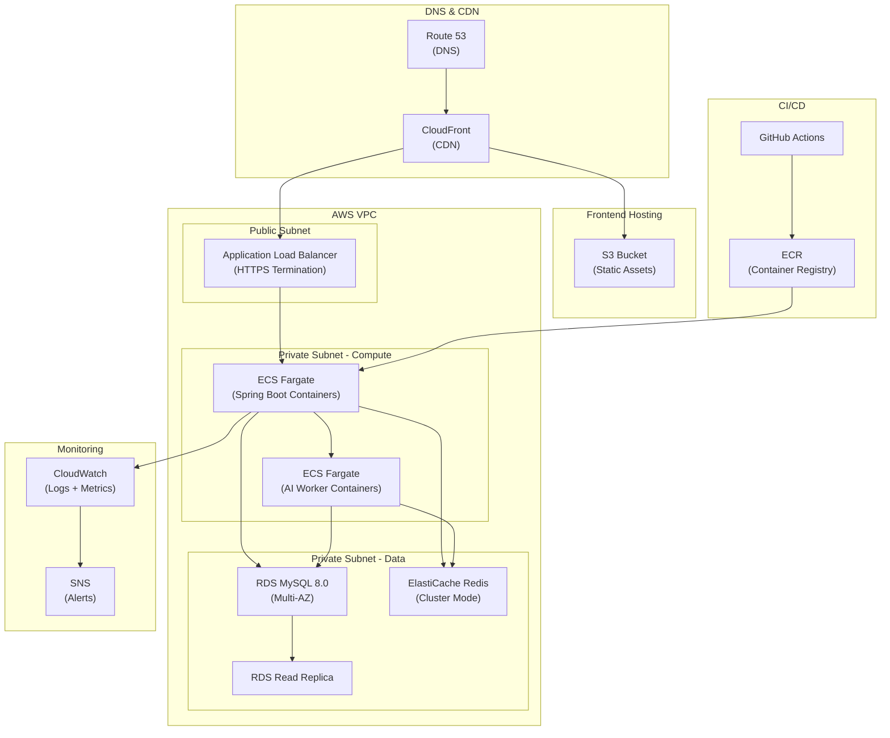
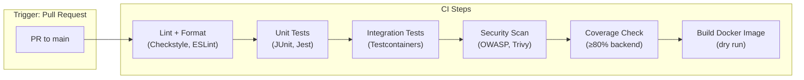

# 13. Deployment Architecture

[← Back to Table of Contents](./00_table_of_contents.md)

---

## 13.1 Infrastructure Diagram



## 13.2 Docker Configuration

### Backend Dockerfile (Multi-Stage)

```dockerfile
# ---- Build Stage ----
FROM eclipse-temurin:21-jdk-alpine AS build
WORKDIR /app

# Cache Gradle dependencies
COPY gradle/ gradle/
COPY gradlew build.gradle settings.gradle ./
RUN chmod +x gradlew && ./gradlew dependencies --no-daemon

# Build application
COPY src/ src/
RUN ./gradlew bootJar --no-daemon -x test

# ---- Runtime Stage ----
FROM eclipse-temurin:21-jre-alpine

# Security: non-root user
RUN addgroup -S app && adduser -S app -G app

WORKDIR /app
COPY --from=build /app/build/libs/*.jar app.jar

# Security: drop to non-root
USER app

EXPOSE 8080

# Health check
HEALTHCHECK --interval=30s --timeout=5s --start-period=60s --retries=3 \
  CMD wget -qO- http://localhost:8080/actuator/health || exit 1

# JVM optimization for containers
ENTRYPOINT ["java", \
  "-XX:+UseG1GC", \
  "-XX:MaxRAMPercentage=75", \
  "-XX:+UseContainerSupport", \
  "-Djava.security.egd=file:/dev/./urandom", \
  "-jar", "app.jar"]
```

### Docker Compose (Development)

```yaml
version: '3.9'

services:
  # ---- Backend API ----
  backend:
    build:
      context: ./leethub-backend
      dockerfile: docker/Dockerfile
    ports:
      - "8080:8080"
      - "5005:5005"  # Debug port
    environment:
      SPRING_PROFILES_ACTIVE: dev
      SPRING_DATASOURCE_URL: jdbc:mysql://mysql:3306/leethub?useSSL=false&allowPublicKeyRetrieval=true
      SPRING_DATASOURCE_USERNAME: root
      SPRING_DATASOURCE_PASSWORD: devpassword
      SPRING_DATA_REDIS_HOST: redis
      SPRING_DATA_REDIS_PORT: 6379
      GITHUB_CLIENT_ID: ${GITHUB_CLIENT_ID}
      GITHUB_CLIENT_SECRET: ${GITHUB_CLIENT_SECRET}
      JWT_PRIVATE_KEY: ${JWT_PRIVATE_KEY}
      OPENAI_API_KEY: ${OPENAI_API_KEY}
      JAVA_TOOL_OPTIONS: "-agentlib:jdwp=transport=dt_socket,server=y,suspend=n,address=*:5005"
    depends_on:
      mysql:
        condition: service_healthy
      redis:
        condition: service_healthy
    volumes:
      - ./leethub-backend/src:/app/src  # Hot reload
    networks:
      - leethub-network

  # ---- Frontend Dev Server ----
  frontend:
    build:
      context: ./leethub-frontend
      dockerfile: Dockerfile.dev
    ports:
      - "3000:3000"
    environment:
      VITE_API_BASE_URL: http://localhost:8080/api/v1
    volumes:
      - ./leethub-frontend/src:/app/src
    networks:
      - leethub-network

  # ---- MySQL Database ----
  mysql:
    image: mysql:8.0
    ports:
      - "3306:3306"
    environment:
      MYSQL_ROOT_PASSWORD: devpassword
      MYSQL_DATABASE: leethub
      MYSQL_CHARACTER_SET: utf8mb4
      MYSQL_COLLATION: utf8mb4_unicode_ci
    volumes:
      - mysql_data:/var/lib/mysql
      - ./leethub-backend/src/main/resources/db/migration:/docker-entrypoint-initdb.d
    healthcheck:
      test: ["CMD", "mysqladmin", "ping", "-h", "localhost"]
      interval: 10s
      timeout: 5s
      retries: 5
    networks:
      - leethub-network

  # ---- Redis Cache ----
  redis:
    image: redis:7-alpine
    ports:
      - "6379:6379"
    command: redis-server --appendonly yes
    volumes:
      - redis_data:/data
    healthcheck:
      test: ["CMD", "redis-cli", "ping"]
      interval: 10s
      timeout: 5s
      retries: 5
    networks:
      - leethub-network

  # ---- Redis Commander (Dev UI) ----
  redis-commander:
    image: rediscommander/redis-commander:latest
    ports:
      - "8081:8081"
    environment:
      REDIS_HOSTS: local:redis:6379
    depends_on:
      - redis
    networks:
      - leethub-network

volumes:
  mysql_data:
  redis_data:

networks:
  leethub-network:
    driver: bridge
```

## 13.3 CI/CD Pipeline

### CI Pipeline (ci.yml)



### GitHub Actions — CI Workflow

```yaml
# .github/workflows/ci.yml
name: CI

on:
  pull_request:
    branches: [main]

jobs:
  backend-ci:
    runs-on: ubuntu-latest
    services:
      mysql:
        image: mysql:8.0
        env:
          MYSQL_ROOT_PASSWORD: testpass
          MYSQL_DATABASE: leethub_test
        ports: ['3306:3306']
        options: --health-cmd="mysqladmin ping" --health-interval=10s
      redis:
        image: redis:7-alpine
        ports: ['6379:6379']
        options: --health-cmd="redis-cli ping" --health-interval=10s

    steps:
      - uses: actions/checkout@v4
      - uses: actions/setup-java@v4
        with:
          java-version: '21'
          distribution: 'temurin'

      - name: Lint (Checkstyle)
        run: ./gradlew checkstyleMain

      - name: Unit Tests
        run: ./gradlew test

      - name: Integration Tests
        run: ./gradlew integrationTest

      - name: Coverage Check
        run: ./gradlew jacocoTestCoverageVerification

      - name: OWASP Dependency Check
        run: ./gradlew dependencyCheckAnalyze

      - name: Build Docker Image (dry run)
        run: docker build -t leethub-backend:ci -f docker/Dockerfile .

  frontend-ci:
    runs-on: ubuntu-latest
    steps:
      - uses: actions/checkout@v4
      - uses: actions/setup-node@v4
        with:
          node-version: '20'

      - run: npm ci
      - run: npm run lint
      - run: npm run type-check
      - run: npm run test -- --coverage
      - run: npm run build
```

### CD Pipeline (cd-staging.yml)

```yaml
# .github/workflows/cd-staging.yml
name: Deploy Staging

on:
  push:
    branches: [main]

jobs:
  deploy:
    runs-on: ubuntu-latest
    environment: staging
    steps:
      - uses: actions/checkout@v4

      - name: Configure AWS Credentials
        uses: aws-actions/configure-aws-credentials@v4
        with:
          aws-access-key-id: ${{ secrets.AWS_ACCESS_KEY_ID }}
          aws-secret-access-key: ${{ secrets.AWS_SECRET_ACCESS_KEY }}
          aws-region: us-east-1

      - name: Login to ECR
        uses: aws-actions/amazon-ecr-login@v2

      - name: Build & Push Backend Image
        run: |
          docker build -t $ECR_REGISTRY/leethub-backend:$GITHUB_SHA -f docker/Dockerfile .
          docker push $ECR_REGISTRY/leethub-backend:$GITHUB_SHA

      - name: Deploy to ECS (Staging)
        run: |
          aws ecs update-service \
            --cluster leethub-staging \
            --service leethub-api \
            --force-new-deployment \
            --task-definition leethub-api:latest

      - name: Deploy Frontend to S3
        run: |
          cd leethub-frontend
          npm ci && npm run build
          aws s3 sync dist/ s3://leethub-staging-frontend/ --delete
          aws cloudfront create-invalidation --distribution-id $CF_DIST_ID --paths "/*"

      - name: Smoke Tests
        run: |
          sleep 60  # Wait for deployment
          curl -f https://staging-api.leethub.ai/actuator/health
          curl -f https://staging.leethub.ai
```

### CD Pipeline (cd-production.yml)

```yaml
# .github/workflows/cd-production.yml
name: Deploy Production

on:
  push:
    tags: ['v*']

jobs:
  deploy:
    runs-on: ubuntu-latest
    environment: production
    steps:
      - uses: actions/checkout@v4

      - name: Configure AWS Credentials
        uses: aws-actions/configure-aws-credentials@v4
        with:
          aws-access-key-id: ${{ secrets.AWS_ACCESS_KEY_ID }}
          aws-secret-access-key: ${{ secrets.AWS_SECRET_ACCESS_KEY }}
          aws-region: us-east-1

      - name: Blue/Green Deployment
        run: |
          # Tag the staging image for production
          docker pull $ECR_REGISTRY/leethub-backend:$GITHUB_SHA
          docker tag $ECR_REGISTRY/leethub-backend:$GITHUB_SHA $ECR_REGISTRY/leethub-backend:$GITHUB_REF_NAME
          docker push $ECR_REGISTRY/leethub-backend:$GITHUB_REF_NAME
          
          # Deploy new task definition
          aws ecs update-service \
            --cluster leethub-production \
            --service leethub-api \
            --force-new-deployment

      - name: Health Check
        run: |
          for i in {1..10}; do
            if curl -f https://api.leethub.ai/actuator/health; then
              echo "✅ Production is healthy"
              exit 0
            fi
            sleep 30
          done
          echo "❌ Health check failed"
          exit 1
```

## 13.4 Environment Strategy

| Environment | Purpose | Infrastructure | URL | Data |
|-------------|---------|---------------|-----|------|
| **Local** | Developer machine | Docker Compose | localhost:8080/3000 | Seeded test data |
| **CI** | Automated testing | GitHub Actions runners | N/A | Testcontainers (ephemeral) |
| **Staging** | Pre-production validation | AWS (reduced capacity) | staging.leethub.ai | Sanitized production clone |
| **Production** | Live users | AWS (full capacity, Multi-AZ) | leethub.ai | Real user data |

### Environment Configurations

| Config | Local | Staging | Production |
|--------|-------|---------|------------|
| ECS Tasks | 1 (Docker) | 1 | 2-3 (auto-scale) |
| RDS Instance | MySQL container | db.t3.small | db.t3.medium (Multi-AZ) |
| Read Replica | None | None | 1 |
| Redis | Redis container | cache.t3.micro | cache.t3.small |
| CloudFront | None | Yes | Yes |
| WAF | None | No | Yes |
| SSL | Self-signed | ACM | ACM |
| Logging | Console | CloudWatch | CloudWatch + S3 archive |

## 13.5 Cost Estimate (AWS — Startup Scale)

| Service | Spec | Monthly Cost (est.) |
|---------|------|-------------------|
| ECS Fargate (API) | 2 tasks × 0.5 vCPU, 1 GB | $30 |
| ECS Fargate (AI Worker) | 1 task × 0.5 vCPU, 1 GB | $15 |
| RDS MySQL | db.t3.medium, 50 GB, Multi-AZ | $70 |
| RDS Read Replica | db.t3.small | $25 |
| ElastiCache Redis | cache.t3.micro | $15 |
| S3 + CloudFront | Static hosting + CDN | $5 |
| ALB | Standard | $20 |
| ECR | Image storage | $5 |
| Route 53 | DNS | $1 |
| CloudWatch | Logs + Metrics | $10 |
| Secrets Manager | 5 secrets | $3 |
| **Total** | | **~$200/month** |

> **💡 Budget Alternative:** For early-stage / hackathon deployment, use **Render.com**:
> - Free web service (backend) — $0
> - Free PostgreSQL 256 MB — $0
> - Free Redis 25 MB — $0
> - Total: **$0/month** (with scaling limitations)

## 13.6 Chrome Web Store Deployment

| Step | Action | Notes |
|------|--------|-------|
| 1 | `npm run build` | Produces extension bundle in `dist/` |
| 2 | Zip `dist/` folder | Include manifest.json, all JS/CSS/icons |
| 3 | Upload to Chrome Web Store Developer Dashboard | $5 one-time registration fee |
| 4 | Fill listing info | Description, screenshots, privacy policy |
| 5 | Submit for review | Typically 1-3 business days |
| 6 | Publish | Available to all Chrome users |

### Extension Auto-Update

```json
// manifest.json — Chrome auto-updates via Web Store
{
  "update_url": "https://clients2.google.com/service/update2/crx"
}
```

---

[← Previous: Folder Structure](./12_folder_structure.md) | [Next: Risk Analysis →](./14_risk_analysis.md)
