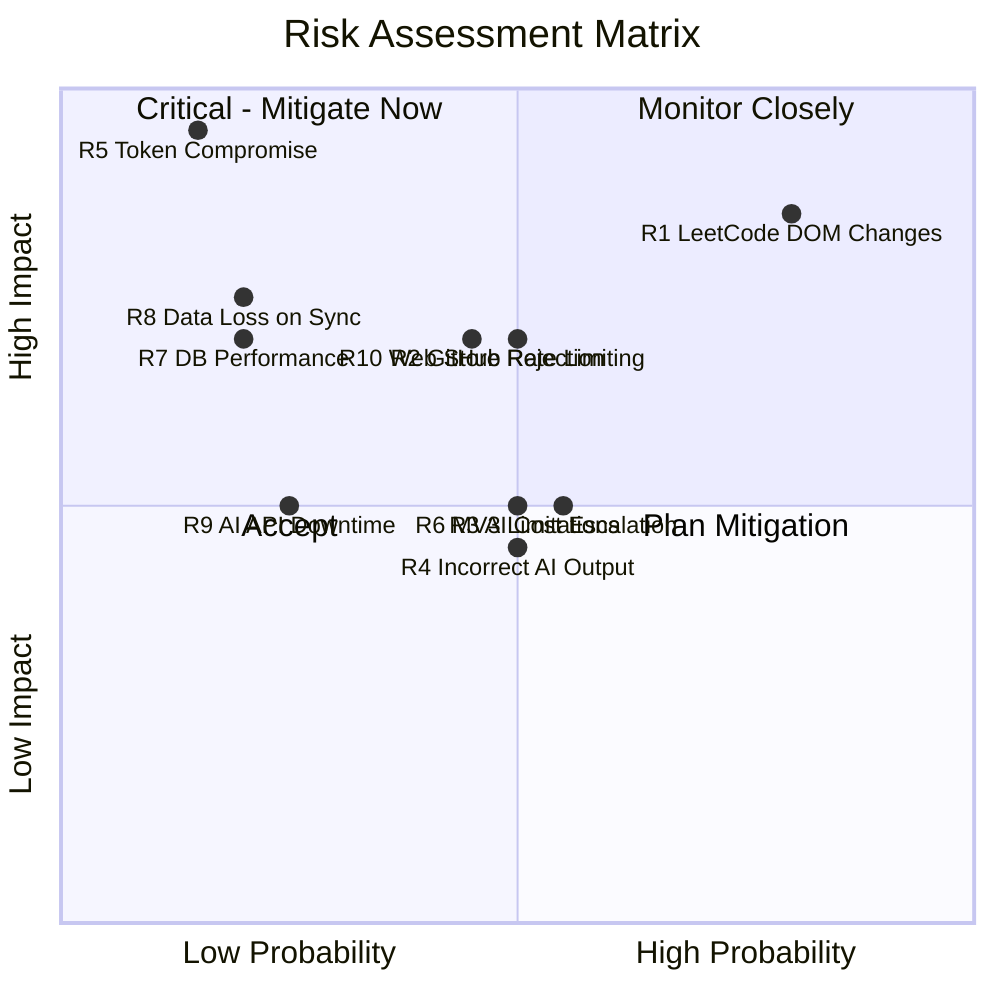

# 14. Risk Analysis

[← Back to Table of Contents](./00_table_of_contents.md)

---

## 14.1 Risk Matrix

## 14.2 Detailed Risk Register

### R1: LeetCode DOM Changes Break Detection 🔴 Critical

| Attribute | Detail |
|-----------|--------|
| **Probability** | High (LeetCode updates frequently) |
| **Impact** | High (core feature breaks) |
| **Severity** | 🔴 Critical |
| **Category** | Technical — External Dependency |

**Description:** LeetCode frequently updates its frontend. DOM structure changes can break the content script's submission detection and metadata extraction, rendering the extension non-functional.

**Mitigation Strategies:**
1. **Multi-strategy detection** — Use DOM mutation observer + XHR/fetch interception + GraphQL response parsing. If one breaks, others provide fallback.
2. **Selector abstraction** — All CSS selectors stored in a versioned configuration file, not hardcoded. Quick-patch release without full re-review.
3. **Automated regression testing** — Selenium/Playwright tests that run daily against live LeetCode pages. Alert on detection failure.
4. **Community monitoring** — Open-source the detection module. Community can report breakages and submit fixes.
5. **Graceful degradation** — If auto-detection fails, prompt user for manual sync with a clipboard-paste fallback.

---

### R2: GitHub API Rate Limiting 🟠 High

| Attribute | Detail |
|-----------|--------|
| **Probability** | Medium |
| **Impact** | High (sync pipeline stalls) |
| **Severity** | 🟠 High |
| **Category** | Technical — External API |

**Description:** GitHub API limits authenticated requests to 5,000/hour. Burst sync activity (e.g., batch-syncing old solutions) could exhaust the quota.

**Mitigation Strategies:**
1. **Batch commits** — Use GitHub Git Trees API to commit multiple files in a single API call instead of one call per file.
2. **Request queuing** — Queue GitHub API calls with rate-aware scheduling. Back off when approaching 80% of limit.
3. **Cache repo metadata** — Cache repository tree structure to avoid repeated GET calls.
4. **User-level rate tracking** — Track each user's remaining quota. Defer non-urgent operations.
5. **GitHub App migration** — Future: upgrade from OAuth App to GitHub App for higher rate limits (5,000 → 12,500/hr per installation).

---

### R3: AI API Costs Escalate 🟡 Medium

| Attribute | Detail |
|-----------|--------|
| **Probability** | Medium |
| **Impact** | Medium (affects profitability) |
| **Severity** | 🟡 Medium |
| **Category** | Financial |

**Description:** Each AI explanation consumes ~2,000-4,000 tokens. At $0.005/1K tokens (GPT-4o), each explanation costs ~$0.01-0.02. With 10K users submitting 5 solutions/day, daily cost could reach $500-1,000.

**Mitigation Strategies:**
1. **Token budget per user** — Free tier: 50 AI explanations/month. Pro tier: unlimited.
2. **Problem-level caching** — Many users solve the same problems. Cache AI explanations by problem ID (not user-specific parts like code review).
3. **Prompt optimization** — Minimize system prompt length. Use structured output format to reduce response tokens.
4. **Gemini as default** — Use Gemini Flash (cheaper) as default, GPT-4o for Pro users only.
5. **User toggle** — Allow users to disable AI generation to reduce costs.
6. **Batch processing** — Combine multiple explanations into fewer API calls during off-peak hours.

**Cost Projection:**

| Users | Solutions/Day | AI Cost/Day | AI Cost/Month |
|-------|--------------|-------------|---------------|
| 1,000 | 3,000 | $30-60 | $900-1,800 |
| 10,000 | 30,000 | $300-600 | $9,000-18,000 |
| 100,000 | 150,000 | $1,500-3,000 | $45,000-90,000 |

---

### R4: AI Generates Incorrect Explanations 🟡 Medium

| Attribute | Detail |
|-----------|--------|
| **Probability** | Medium |
| **Impact** | Medium (user trust erosion) |
| **Severity** | 🟡 Medium |
| **Category** | Quality |

**Mitigation Strategies:**
1. **Structured prompts** — Use chain-of-thought prompting with explicit output schema.
2. **Low temperature** — Set `temperature=0.2` for deterministic, factual responses.
3. **Complexity validation** — Parse and validate time/space complexity against known solutions.
4. **User feedback** — "Was this explanation helpful?" button. Flag low-rated explanations for review.
5. **Disclaimer** — Display "AI-generated content. Please verify." on all explanations.

---

### R5: GitHub Access Token Compromise 🔴 Critical

| Attribute | Detail |
|-----------|--------|
| **Probability** | Low |
| **Impact** | Critical (full repo access) |
| **Severity** | 🔴 Critical |
| **Category** | Security |

**Mitigation Strategies:**
1. **AES-256-GCM encryption** — All tokens encrypted at rest with application-managed keys.
2. **Minimal scopes** — Request only `repo` and `user:email` scopes.
3. **Token rotation** — Refresh tokens are single-use. Access tokens expire in 1 hour.
4. **Audit logging** — All token usage logged with IP address and operation context.
5. **Breach detection** — Monitor for unusual API patterns (e.g., accessing repos user doesn't own).
6. **Incident response** — Automated token revocation on breach detection. User notification within 24 hours.
7. **AWS Secrets Manager** — Encryption keys stored in AWS, not in code or environment variables.

---

### R6: Chrome Manifest V3 Limitations 🟡 Medium

| Attribute | Detail |
|-----------|--------|
| **Probability** | Medium |
| **Impact** | Medium (feature limitations) |
| **Severity** | 🟡 Medium |
| **Category** | Technical — Platform |

**Description:** MV3 replaces persistent background pages with service workers that can be terminated after 30 seconds of inactivity. This complicates long-running operations and state management.

**Mitigation Strategies:**
1. **Chrome Alarms API** — Use `chrome.alarms` to periodically wake up the service worker.
2. **Chrome Offscreen API** — Use offscreen documents for operations that need longer execution.
3. **State persistence** — Store all state in `chrome.storage` instead of in-memory variables.
4. **Server-side processing** — Move all heavy processing to the backend. Extension only captures and sends.
5. **Connection keepalive** — Use `chrome.runtime.connect` for persistent messaging during active sync.

---

### R7: Database Performance Degradation 🟠 High

| Attribute | Detail |
|-----------|--------|
| **Probability** | Low |
| **Impact** | High (slow dashboard, poor UX) |
| **Severity** | 🟠 High |
| **Category** | Technical — Infrastructure |

**Mitigation Strategies:**
1. **Indexing strategy** — Composite indexes on all frequent query patterns. EXPLAIN analysis in CI.
2. **Connection pooling** — HikariCP with optimized pool sizing.
3. **Read replicas** — Route analytics/search queries to read replica.
4. **Redis caching** — Cache all analytics aggregates with TTL-based invalidation.
5. **Query monitoring** — Slow query log enabled. Alert on queries > 500ms.
6. **Table partitioning** — Partition `solutions` table by year for efficient archival.

---

### R8: Data Loss During Sync Failure 🟠 High

| Attribute | Detail |
|-----------|--------|
| **Probability** | Low |
| **Impact** | High (user loses submissions) |
| **Severity** | 🟠 High |
| **Category** | Reliability |

**Mitigation Strategies:**
1. **Persist first** — Save submission to database BEFORE attempting GitHub push.
2. **Idempotent operations** — Sync operations are safe to retry (check-before-write on GitHub).
3. **Retry with backoff** — Exponential backoff with up to 5 retries for GitHub failures.
4. **Dead letter queue** — Failed syncs moved to DLQ for manual investigation.
5. **Extension offline queue** — IndexedDB-backed queue in extension for offline resilience.
6. **Status tracking** — Every sync event logged in `sync_history` table for auditability.

---

### R9: AI Provider API Downtime 🟡 Medium

| Attribute | Detail |
|-----------|--------|
| **Probability** | Low |
| **Impact** | Medium (AI features unavailable) |
| **Severity** | 🟡 Medium |
| **Category** | Technical — External Dependency |

**Mitigation Strategies:**
1. **Dual provider** — Automatic fallback from OpenAI to Gemini (and vice versa).
2. **Graceful degradation** — Sync continues without AI. Explanation generated later when API recovers.
3. **Queue-based retry** — Failed AI jobs remain in queue. Processed when service recovers.
4. **Circuit breaker** — After 5 consecutive failures, circuit opens. Periodic probe to check recovery.
5. **Status page monitoring** — Monitor OpenAI/Google status pages for proactive alerting.

---

### R10: Chrome Web Store Rejection 🟠 High

| Attribute | Detail |
|-----------|--------|
| **Probability** | Medium |
| **Impact** | High (blocks distribution) |
| **Severity** | 🟠 High |
| **Category** | Business — Distribution |

**Description:** Chrome Web Store has strict policies. Common rejection reasons: excessive permissions, remote code loading, unclear data usage, missing privacy policy.

**Mitigation Strategies:**
1. **Minimal permissions** — Only request `storage`, `alarms`, `identity`. Use `host_permissions` only for LeetCode and our API.
2. **No remote code** — All code bundled in the extension. No `eval()`, no dynamic script injection.
3. **Clear privacy policy** — Document all data collected, stored, and transmitted. Published on website.
4. **Accurate listing** — Description matches actual functionality. No misleading claims.
5. **Pre-submission review** — Use Chrome Extension Audit checklist before every submission.
6. **Sideloading fallback** — Distribute via GitHub releases for developer-mode installation while awaiting approval.

---

## 14.3 Risk Severity Legend

| Severity | Definition | Action Required |
|----------|-----------|-----------------|
| 🔴 **Critical** | Blocks launch or causes data breach | Must mitigate before MVP launch |
| 🟠 **High** | Degrades core functionality significantly | Mitigate within Phase 1 |
| 🟡 **Medium** | Affects non-critical features or edge cases | Plan mitigation for Phase 2 |
| 🟢 **Low** | Minor inconvenience | Accept and monitor |

## 14.4 Contingency Plans

| Scenario | Immediate Response | Long-Term Plan |
|----------|-------------------|----------------|
| LeetCode blocks extension | Switch to clipboard/manual paste mode | Explore LeetCode API partnership |
| AI costs exceed budget | Switch to Gemini Flash only; disable AI for free tier | Offer AI as premium feature |
| GitHub changes OAuth policy | Support GitHub Apps auth as alternative | Add PAT-based auth fallback |
| Single-user data breach | Auto-revoke all tokens, notify user within 24h | Full incident response protocol |
| Cloud provider outage | Failover DNS to backup region | Multi-region deployment in Phase 4 |

---

[← Previous: Deployment Architecture](./13_deployment_architecture.md) | [Next: Future Enhancements →](./15_future_enhancements.md)
