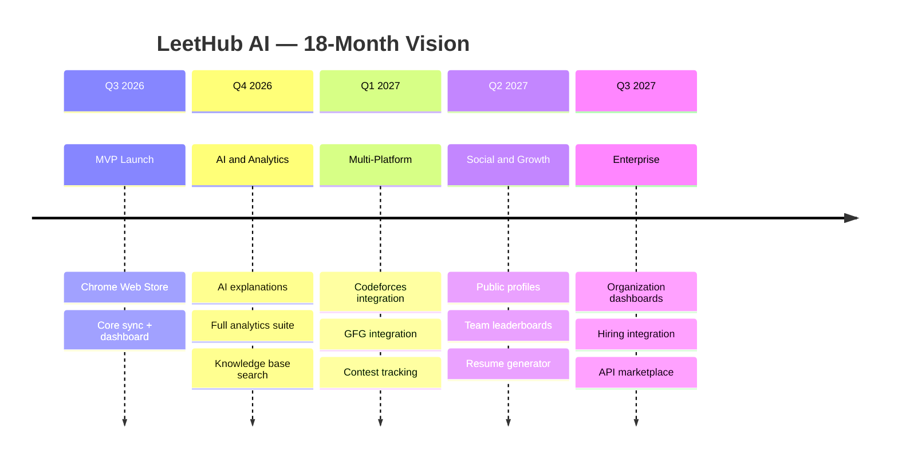

# 15. Future Enhancements

[← Back to Table of Contents](./00_table_of_contents.md)

---

## 15.1 Startup-Scale Roadmap (18 Months)



## 15.2 Multi-Platform Integration

### Platform Support Roadmap

| Platform | Detection Strategy | Priority | Complexity | Est. Timeline |
|----------|-------------------|----------|------------|---------------|
| **Codeforces** | DOM mutation + `/status` page scraping | P1 | Medium | 2 weeks |
| **GeeksforGeeks** | DOM observer on submission verdict | P2 | Medium | 2 weeks |
| **HackerRank** | Network request interception (SPA) | P2 | High | 3 weeks |
| **CodingNinjas** | DOM observer | P3 | Medium | 2 weeks |
| **AtCoder** | DOM observer + `/submissions/me` page | P3 | Low | 1 week |
| **SPOJ** | DOM observer | P4 | Low | 1 week |

### Platform Abstraction Architecture

```typescript
// Plugin-based platform abstraction
interface PlatformDetector {
  platformName: string;
  matchUrl(url: string): boolean;
  detectSubmission(document: Document): Submission | null;
  extractMetadata(document: Document): ProblemMetadata;
  extractCode(document: Document): string;
  getSubmissionVerdict(document: Document): 'accepted' | 'rejected' | null;
}

// Each platform implements this interface
class LeetCodeDetector implements PlatformDetector { ... }
class CodeforcesDetector implements PlatformDetector { ... }
class GFGDetector implements PlatformDetector { ... }

// Factory selects detector based on current URL
class PlatformDetectorFactory {
  private detectors: PlatformDetector[] = [
    new LeetCodeDetector(),
    new CodeforcesDetector(),
    new GFGDetector(),
  ];
  
  getDetector(url: string): PlatformDetector | null {
    return this.detectors.find(d => d.matchUrl(url)) ?? null;
  }
}
```

### GitHub Folder Structure (Multi-Platform)

```
coding-solutions/
├── LeetCode/
│   ├── Arrays/
│   │   └── Two Sum/
│   │       ├── solution.java
│   │       └── README.md
│   └── README.md
├── Codeforces/
│   ├── Div2/
│   │   └── 1920A_Satisfying_Constraints/
│   │       ├── solution.cpp
│   │       └── README.md
│   └── README.md
├── GeeksforGeeks/
│   └── ...
└── README.md            ← Auto-generated cross-platform index
```

## 15.3 Contest Tracking

### Features

- **Contest calendar** — Aggregated calendar from all platforms with reminders
- **Live tracking** — Real-time contest status and problem sync
- **Performance analytics** — Rating trends, percentile tracking, performance graphs
- **Virtual contests** — Track virtual contest participation
- **Contest solution auto-sync** — Solutions synced with contest metadata (rank, time taken)

### Data Model Extension

```sql
CREATE TABLE contests (
    id BIGINT AUTO_INCREMENT PRIMARY KEY,
    platform VARCHAR(30) NOT NULL,
    contest_id VARCHAR(50) NOT NULL,
    contest_name VARCHAR(300) NOT NULL,
    start_time TIMESTAMP NOT NULL,
    duration_minutes INT NOT NULL,
    user_rank INT,
    user_rating_change INT,
    created_at TIMESTAMP DEFAULT CURRENT_TIMESTAMP
);

CREATE TABLE contest_solutions (
    id BIGINT AUTO_INCREMENT PRIMARY KEY,
    contest_id BIGINT NOT NULL,
    solution_id BIGINT NOT NULL,
    problem_index VARCHAR(5),       -- e.g., "A", "B", "C"
    time_to_solve_minutes INT,
    penalty INT,
    FOREIGN KEY (contest_id) REFERENCES contests(id),
    FOREIGN KEY (solution_id) REFERENCES solutions(id)
);
```

## 15.4 Resume Generation

### Features

- Auto-generate professional resumes from solve history
- Highlight strongest topics and algorithmic patterns
- Include GitHub contribution statistics
- Multiple template styles (FAANG, startup, academic)
- Export formats: PDF, LaTeX, Markdown, DOCX

### Resume Sections (Auto-Generated)

```markdown
# John Doe — Software Engineer

## Competitive Programming Profile
- **Total Problems Solved:** 450+ across LeetCode, Codeforces
- **LeetCode Rating:** 1,850 (Top 5%)
- **Codeforces Rating:** 1,600 (Expert)

## Strongest Topics
1. Dynamic Programming — 85% solve rate (42/50 problems)
2. Graph Algorithms — 78% solve rate (35/45 problems)  
3. Binary Search — 92% solve rate (23/25 problems)

## Notable Achievements
- 34-day solving streak
- Top 10% in LeetCode Weekly Contest #350
- 450+ GitHub contributions from solution sync

## Technical Skills
- **Languages:** Java (60%), Python (25%), C++ (15%)
- **Patterns:** DP, BFS/DFS, Sliding Window, Two Pointers, Union Find
```

## 15.5 Public Profile & Social Features

### Public Profile Page

- Shareable URL: `leethub.ai/@username`
- Customizable dashboard with privacy controls
- Embeddable widgets for personal websites
- Social sharing cards (Twitter, LinkedIn)

### Social Features

| Feature | Description | Priority |
|---------|-------------|----------|
| **Public Profile** | Customizable solve stats page | P1 |
| **Shareable Links** | Share individual problem solutions | P2 |
| **Embeddable Widgets** | `<iframe>` embed for portfolios | P2 |
| **Social Cards** | OpenGraph meta tags for link previews | P1 |
| **Follow System** | Follow other users, see their activity | P3 |
| **Study Groups** | Create groups, share problem lists | P3 |

### Embeddable Widget Example

```html
<!-- Embed in personal portfolio -->
<iframe 
  src="https://leethub.ai/embed/@johndoe/stats" 
  width="400" 
  height="200" 
  frameborder="0"
  title="LeetHub AI Stats"
></iframe>
```

## 15.6 Team & Organization Features

### Team Leaderboards

- Create teams (study groups, bootcamp cohorts, company teams)
- Weekly/monthly competitive leaderboards
- Team-level analytics (aggregate solve rates, topic coverage)
- Challenge mode (team vs. team competitions)

### Organization Dashboard (Enterprise)

- Hiring manager view: candidate problem-solving profiles
- Skill assessment: topic coverage analysis
- Interview prep tracking: candidate progress monitoring
- SSO integration (SAML, OIDC)
- Custom branding

## 15.7 Advanced AI Features

| Feature | Description | Technology | Priority |
|---------|-------------|-----------|----------|
| **Code Review** | AI-powered code quality feedback (naming, edge cases, style) | GPT-4o | P2 |
| **Alternative Solutions** | Generate solutions in different languages | Gemini | P2 |
| **Hint System** | Progressive hints (3 levels) for unsolved problems | GPT-4o | P3 |
| **Spaced Repetition** | SM-2 algorithm scheduling for revision | Custom algorithm | P2 |
| **Mock Interview** | AI-driven mock interview with follow-up questions | GPT-4o + TTS | P3 |
| **Solution Comparison** | Compare user's solution with optimal approaches | Gemini | P3 |
| **Learning Path** | AI-generated personalized study plans based on weaknesses | GPT-4o | P3 |

### Spaced Repetition (SM-2 Algorithm)

```java
public class SpacedRepetitionService {
    
    /**
     * SM-2 Algorithm for scheduling reviews
     * @param quality User's self-rating (0-5)
     * @param repetitions Number of times reviewed
     * @param easeFactor Current ease factor (default 2.5)
     * @param interval Current interval in days
     */
    public ReviewSchedule calculateNext(int quality, int repetitions, 
                                         double easeFactor, int interval) {
        if (quality >= 3) {
            // Correct response
            if (repetitions == 0) interval = 1;
            else if (repetitions == 1) interval = 6;
            else interval = (int) Math.round(interval * easeFactor);
            
            repetitions++;
            easeFactor = easeFactor + (0.1 - (5 - quality) * (0.08 + (5 - quality) * 0.02));
            easeFactor = Math.max(1.3, easeFactor);
        } else {
            // Incorrect — reset
            repetitions = 0;
            interval = 1;
        }
        
        return new ReviewSchedule(
            LocalDate.now().plusDays(interval),
            repetitions, easeFactor, interval
        );
    }
}
```

## 15.8 Browser Extension Expansion

| Browser | Engine | Extension API | Est. Effort |
|---------|--------|---------------|-------------|
| **Chrome** | Chromium | MV3 ✅ (built) | Done |
| **Edge** | Chromium | MV3 (compatible) | 1 day (repackage) |
| **Brave** | Chromium | MV3 (compatible) | 1 day (repackage) |
| **Firefox** | Gecko | WebExtensions (MV2/3) | 1-2 weeks (API differences) |
| **Safari** | WebKit | Safari Web Extensions | 2-3 weeks (Xcode wrapper) |

## 15.9 Monetization Strategy

### Pricing Tiers

| Tier | Price | Included | Target |
|------|-------|----------|--------|
| **Free** | $0/mo | 50 syncs/month, basic analytics, 10 AI explanations/month | Students |
| **Pro** | $5/mo | Unlimited syncs, full AI, advanced analytics, priority support | Job seekers |
| **Team** | $3/user/mo | Pro features + team leaderboards, shared study plans, admin dashboard | Study groups |
| **Enterprise** | Custom | Team + SSO, hiring integrations, dedicated support, SLA, white-label | Companies |

### Revenue Projections

| Quarter | Free Users | Pro Users | Team Users | MRR |
|---------|-----------|-----------|------------|-----|
| Q3 2026 | 1,000 | 50 | 0 | $250 |
| Q4 2026 | 5,000 | 300 | 20 | $1,560 |
| Q1 2027 | 15,000 | 1,000 | 100 | $5,300 |
| Q2 2027 | 40,000 | 3,000 | 500 | $16,500 |
| Q3 2027 | 80,000 | 8,000 | 2,000 | $46,000 |

### Additional Revenue Streams

| Stream | Description | Est. Launch |
|--------|-------------|-------------|
| **API Access** | Third-party developers build on LeetHub AI data | Q3 2027 |
| **Premium Templates** | Custom resume/profile templates | Q2 2027 |
| **Sponsored Challenges** | Companies sponsor coding challenges | Q3 2027 |
| **Hiring Platform** | Companies discover candidates via solve profiles | Q4 2027 |

## 15.10 Technical Debt & Architecture Evolution

| Phase | Architecture | Trigger |
|-------|-------------|---------|
| Current | Modular Monolith | MVP |
| Phase 2 | Extract AI Worker as separate service | AI processing > 30% of compute |
| Phase 3 | Extract Sync Service | GitHub rate limit contention |
| Phase 4 | Full microservices with service mesh | > 100K users, multi-region needed |

### Technology Upgrades

| Current | Future | Trigger |
|---------|--------|---------|
| MySQL Full-Text Search | Elasticsearch | Search queries > 10K RPM |
| Redis Streams | Apache Kafka | Event volume > 100K/day |
| REST APIs | GraphQL (frontend) | Complex nested data queries |
| Server-Side Rendering | None → SSR (Next.js) | SEO for public profiles |
| Single Region | Multi-Region | Global user base > 100K |

---

## Appendix

### Glossary

| Term | Definition |
|------|-----------|
| **MV3** | Chrome Extension Manifest V3, the latest extension platform |
| **Service Worker** | Background script in MV3 (replaces persistent background pages) |
| **Content Script** | JavaScript injected into web pages by the extension |
| **PKCE** | Proof Key for Code Exchange — OAuth security extension |
| **JWT** | JSON Web Token — stateless authentication token |
| **TDE** | Transparent Data Encryption — database-level encryption |
| **DLQ** | Dead Letter Queue — failed message storage for investigation |
| **SM-2** | SuperMemo 2 — spaced repetition scheduling algorithm |
| **RBAC** | Role-Based Access Control |
| **CSP** | Content Security Policy — browser security header |
| **RPM** | Requests Per Minute |
| **DAU** | Daily Active Users |
| **MRR** | Monthly Recurring Revenue |

### References

| # | Reference | URL |
|---|-----------|-----|
| 1 | Chrome MV3 Migration Guide | https://developer.chrome.com/docs/extensions/develop/migrate |
| 2 | GitHub REST API v3 | https://docs.github.com/en/rest |
| 3 | GitHub GraphQL API v4 | https://docs.github.com/en/graphql |
| 4 | OpenAI API Reference | https://platform.openai.com/docs/api-reference |
| 5 | Gemini API Documentation | https://ai.google.dev/docs |
| 6 | Spring Boot 3.x Reference | https://docs.spring.io/spring-boot/docs/current/reference/html |
| 7 | Redis Streams Documentation | https://redis.io/docs/data-types/streams |
| 8 | AWS ECS Best Practices | https://docs.aws.amazon.com/AmazonECS/latest/bestpracticesguide |
| 9 | SM-2 Algorithm | https://www.supermemo.com/en/archives1990-2015/english/ol/sm2 |
| 10 | OAuth 2.0 + PKCE (RFC 7636) | https://tools.ietf.org/html/rfc7636 |

---

*Document generated: June 22, 2026 • Version 1.0.0 • Status: Draft — Pending Review*

[← Previous: Risk Analysis](./14_risk_analysis.md) | [Back to Table of Contents →](./00_table_of_contents.md)
