# LeetHub AI — Software Architecture Document

**Project:** LeetHub AI – Intelligent LeetCode Progress Tracker & GitHub Sync Platform
**Version:** 1.0.0
**Date:** June 22, 2026
**Classification:** Internal / Engineering Review
**Authors:** Architecture Team

---

> [!NOTE]
> This document is intended for review by Senior Engineers, Tech Leads, Startup CTOs, and Hackathon Judges. It follows IEEE 1471 / ISO/IEC 42010 standards adapted for modern startup engineering.

---

## Table of Contents

1. [Executive Summary](#1-executive-summary)
2. [Functional Requirements](#2-functional-requirements)
3. [Non-Functional Requirements](#3-non-functional-requirements)
4. [System Architecture](#4-system-architecture)
5. [Component Diagram](#5-component-diagram)
6. [Data Flow Diagram](#6-data-flow-diagram)
7. [Database Design](#7-database-design)
8. [API Design](#8-api-design)
9. [Security Architecture](#9-security-architecture)
10. [Scalability Strategy](#10-scalability-strategy)
11. [Development Roadmap](#11-development-roadmap)
12. [Folder Structure](#12-folder-structure)
13. [Deployment Architecture](#13-deployment-architecture)
14. [Risk Analysis](#14-risk-analysis)
15. [Future Enhancements](#15-future-enhancements)

---

## 1. Executive Summary

### 1.1 Project Overview

LeetHub AI is a full-stack platform comprising a **Chrome browser extension**, a **React web dashboard**, and a **Spring Boot backend** that together automate the capture, synchronization, analysis, and organization of competitive programming solutions. The system detects successful LeetCode submissions in real time, extracts rich metadata, generates AI-powered explanations via OpenAI/Gemini APIs, and pushes structured solutions to a user's GitHub repository — all without manual intervention.

### 1.2 Problem Statement

Developers preparing for technical interviews solve hundreds of problems across platforms but lack:

- **Automated archival** — Solutions are lost in browser history or scattered across local files.
- **Structured learning** — No systematic way to review approaches, complexities, and patterns.
- **Portfolio visibility** — GitHub contribution graphs don't reflect LeetCode effort.
- **Progress analytics** — LeetCode's native analytics are shallow and non-exportable.

### 1.3 Objectives

| # | Objective | Success Metric |
|---|-----------|----------------|
| O1 | Automatic GitHub sync on accepted submission | < 5 s end-to-end latency |
| O2 | AI-generated explanations for every solution | 95%+ generation success rate |
| O3 | Rich analytics dashboard | Feature parity with GitHub Contributions heatmap |
| O4 | Searchable knowledge base | Sub-200 ms full-text search |
| O5 | Multi-platform extensibility | Plugin architecture supporting ≥ 4 platforms by v2 |

### 1.4 Stakeholders

| Role | Concern |
|------|---------|
| End Users (Developers) | Seamless sync, useful AI notes, privacy |
| Open Source Contributors | Clean architecture, contribution guidelines |
| Startup CTOs / Investors | Scalability, cost efficiency, moat |
| Hackathon Judges | Innovation, technical depth, completeness |

---

## 2. Functional Requirements

### 2.1 Browser Extension

| ID | Requirement | Priority | Description |
|----|-------------|----------|-------------|
| FR-EXT-01 | Submission Detection | P0 | Detect accepted LeetCode submissions via DOM observation and network interception |
| FR-EXT-02 | Metadata Extraction | P0 | Extract problem title, difficulty, tags, runtime, memory, language, and submitted code |
| FR-EXT-03 | Auto Sync | P0 | Automatically push accepted solutions to GitHub via the backend |
| FR-EXT-04 | Manual Sync | P1 | Allow users to manually trigger sync for any visible submission |
| FR-EXT-05 | Sync History | P1 | Display a log of all past sync operations with status indicators |
| FR-EXT-06 | Settings Panel | P1 | Configure target repository, folder structure preferences, AI toggle, and notification preferences |
| FR-EXT-07 | Auth State | P0 | Persist and refresh authentication tokens securely |
| FR-EXT-08 | Offline Queue | P2 | Queue submissions when offline and sync when connectivity is restored |

### 2.2 GitHub Integration

| ID | Requirement | Priority | Description |
|----|-------------|----------|-------------|
| FR-GH-01 | OAuth Login | P0 | GitHub OAuth 2.0 flow with `repo` and `user:email` scopes |
| FR-GH-02 | Repository Selection | P0 | List user repositories and allow selection of target repo |
| FR-GH-03 | Auto Folder Creation | P0 | Create topic-based folders (e.g., `Arrays/Two Sum/`) automatically |
| FR-GH-04 | Solution Upload | P0 | Upload `solution.{ext}`, `README.md`, and `notes.md` per problem |
| FR-GH-05 | Solution Update | P1 | Update existing files if the user re-submits a better solution |
| FR-GH-06 | Commit History | P1 | Track and display commit history per problem |
| FR-GH-07 | Branch Support | P2 | Allow syncing to non-default branches |

### 2.3 AI Features

| ID | Requirement | Priority | Description |
|----|-------------|----------|-------------|
| FR-AI-01 | Problem Summary | P0 | Generate a concise summary of the problem statement |
| FR-AI-02 | Brute Force Approach | P0 | Describe the naive approach with pseudocode |
| FR-AI-03 | Optimized Approach | P0 | Describe the optimal approach with the submitted code's logic |
| FR-AI-04 | Complexity Analysis | P0 | Determine time and space complexity with justification |
| FR-AI-05 | Pattern Recognition | P1 | Identify algorithmic patterns (e.g., Sliding Window, Two Pointers) |
| FR-AI-06 | Interview Notes | P1 | Generate interviewer-perspective talking points |
| FR-AI-07 | Common Mistakes | P1 | List frequent pitfalls for the problem type |
| FR-AI-08 | Revision Notes | P2 | Create spaced-repetition-friendly summaries |
| FR-AI-09 | Multi-Provider | P1 | Support both OpenAI and Gemini with fallback |

### 2.4 Analytics Dashboard

| ID | Requirement | Priority | Description |
|----|-------------|----------|-------------|
| FR-AN-01 | Summary Stats | P0 | Total solved, Easy/Medium/Hard breakdown |
| FR-AN-02 | Streak Tracking | P0 | Current streak, longest streak, daily/weekly/monthly views |
| FR-AN-03 | Activity Heatmap | P0 | GitHub-style contribution heatmap for submissions |
| FR-AN-04 | Language Stats | P1 | Pie/bar chart of language distribution |
| FR-AN-05 | Topic Performance | P1 | Radar chart of topic-wise solve rates |
| FR-AN-06 | Time Trends | P2 | Runtime improvement trends over time |

### 2.5 Search & Knowledge Base

| ID | Requirement | Priority | Description |
|----|-------------|----------|-------------|
| FR-KB-01 | Full-Text Search | P0 | Search by problem name, tags, difficulty |
| FR-KB-02 | Filter by Pattern | P1 | Filter by algorithm pattern (DP, BFS, DFS, etc.) |
| FR-KB-03 | Filter by DS | P1 | Filter by data structure (Array, Tree, Graph, etc.) |
| FR-KB-04 | Sort Options | P2 | Sort by date, difficulty, topic |

### 2.6 User Notes

| ID | Requirement | Priority | Description |
|----|-------------|----------|-------------|
| FR-NT-01 | Personal Notes | P1 | Free-form markdown notes per problem |
| FR-NT-02 | Mistake Log | P1 | Structured mistake tracking |
| FR-NT-03 | Revision Reminders | P2 | Schedule revision reminders (spaced repetition) |
| FR-NT-04 | Interview Observations | P2 | Tag notes as interview-specific |

---

## 3. Non-Functional Requirements

| Category | Requirement | Target | Rationale |
|----------|-------------|--------|-----------|
| **Performance** | API response time (p95) | < 200 ms (excl. AI calls) | Snappy dashboard UX |
| **Performance** | AI generation latency (p95) | < 8 s | Acceptable for async background task |
| **Performance** | Extension detection latency | < 500 ms after page load | Real-time feel |
| **Scalability** | Concurrent users | 10,000 DAU at launch | Startup-scale initial target |
| **Scalability** | Database reads | 50,000 RPM | Dashboard + search load |
| **Availability** | Uptime SLA | 99.5% | Acceptable for non-critical tooling |
| **Security** | Token storage | AES-256 encrypted at rest | GitHub tokens are high-value targets |
| **Security** | API authentication | JWT with RS256 | Industry standard for stateless auth |
| **Security** | Data in transit | TLS 1.3 | Mandatory for OAuth flows |
| **Reliability** | Sync retry | 3 retries with exponential backoff | GitHub API intermittent failures |
| **Reliability** | Data durability | Daily automated backups | MySQL + S3 backup |
| **Maintainability** | Code coverage | ≥ 80% on backend | CI gate |
| **Maintainability** | API versioning | URI-based (`/api/v1/`) | Non-breaking evolution |
| **Observability** | Logging | Structured JSON logs (ELK-ready) | Debuggability |
| **Observability** | Metrics | Prometheus + Grafana | SRE readiness |

---

## 4. System Architecture

### 4.1 High-Level Architecture

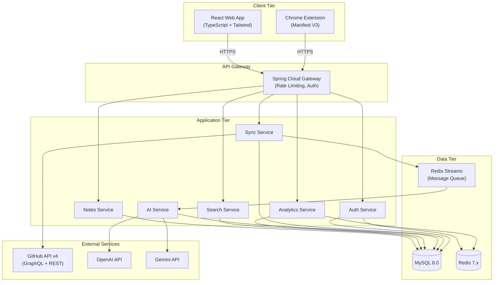

### 4.2 Architecture Style

The system follows a **modular monolith** architecture for the initial release, with clear module boundaries that allow extraction into microservices as scale demands. This balances startup velocity with future scalability.

| Decision | Choice | Rationale |
|----------|--------|-----------|
| Architecture Style | Modular Monolith | Faster initial development, single deployment unit, easy debugging |
| Communication (internal) | Direct method calls | No network overhead in monolith |
| Communication (extension↔backend) | REST over HTTPS | Universal browser support |
| Async Processing | Redis Streams | Lightweight, already in stack for caching |
| API Protocol | REST + JSON | Simplicity, broad tooling support |

### 4.3 Technology Stack Summary

| Layer | Technology | Version | Justification |
|-------|------------|---------|---------------|
| Extension | Chrome Manifest V3 | MV3 | Required by Chrome Web Store (MV2 deprecated) |
| Frontend | React + TypeScript | React 18, TS 5.x | Type safety, ecosystem maturity |
| Styling | Tailwind CSS | 3.x | Utility-first, rapid iteration |
| Backend | Java + Spring Boot | Java 21, Spring Boot 3.3 | Enterprise-grade, massive ecosystem |
| Database | MySQL | 8.0 | ACID compliance, JSON column support, mature tooling |
| Cache | Redis | 7.x | Sub-ms reads, pub/sub, streams |
| AI | OpenAI + Gemini | GPT-4o / Gemini 2.0 | Best-in-class code understanding |
| Auth | JWT + GitHub OAuth | OAuth 2.0 | Industry standard |
| CI/CD | GitHub Actions | N/A | Native GitHub integration |
| Containerization | Docker | 24.x | Reproducible builds |
| Cloud | AWS (ECS/RDS/ElastiCache) | N/A | Scalability, managed services |

---

## 5. Component Diagram

### 5.1 Full Component View

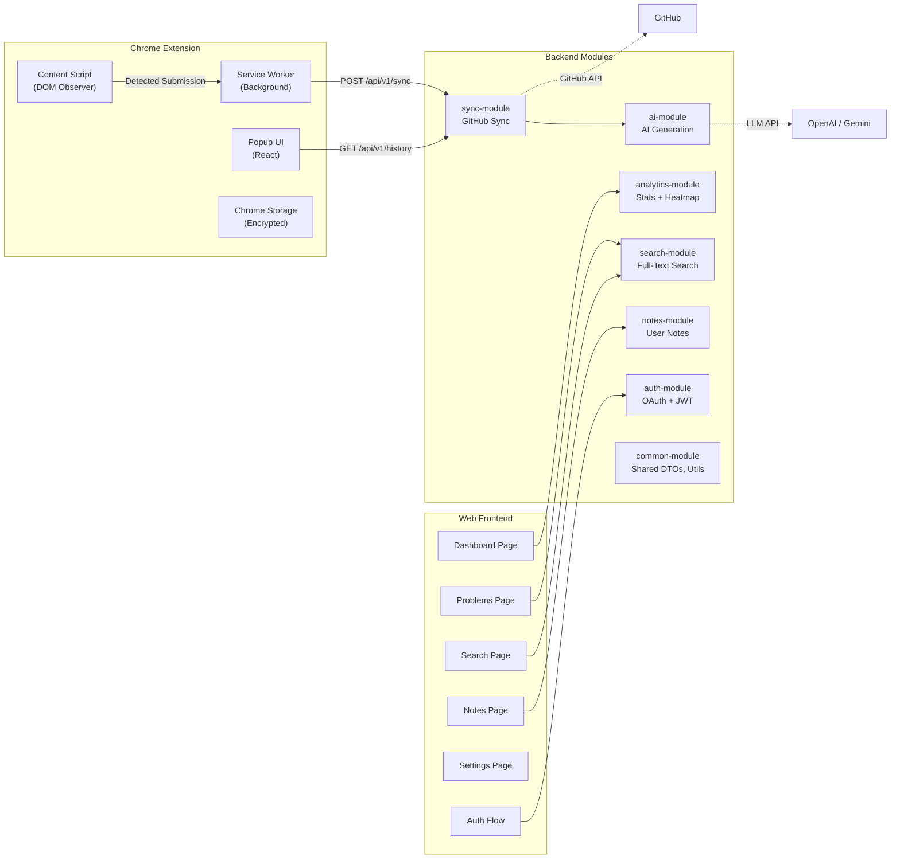

### 5.2 Component Descriptions

| Component | Responsibility | Key Interfaces |
|-----------|---------------|----------------|
| **Content Script** | Injects into LeetCode pages. Observes DOM mutations and XHR responses to detect accepted submissions. Extracts problem metadata and solution code. | `chrome.runtime.sendMessage` to Service Worker |
| **Service Worker** | Long-lived background process (MV3). Manages auth tokens, queues submissions, communicates with backend API. Handles offline queuing. | REST calls to backend, `chrome.storage` for persistence |
| **Popup UI** | React-based popup. Displays sync status, recent history, quick settings. Entry point for login flow. | Communicates with Service Worker via `chrome.runtime` |
| **Auth Module** | Handles GitHub OAuth callback, issues/refreshes JWTs, manages user sessions. Stores refresh tokens in Redis. | `/api/v1/auth/*` endpoints |
| **Sync Module** | Orchestrates the full sync pipeline: receives submission data, triggers AI generation, commits to GitHub, records in database. | `/api/v1/sync/*`, publishes to Redis Streams |
| **AI Module** | Consumes sync events from Redis Streams. Calls OpenAI/Gemini APIs with structured prompts. Parses and stores generated explanations. Implements provider fallback. | Redis Stream consumer, `/api/v1/ai/*` |
| **Analytics Module** | Aggregates solve data into statistics. Computes streaks, heatmaps, topic distributions. Caches heavily in Redis. | `/api/v1/analytics/*` |
| **Search Module** | Provides full-text search over problems, solutions, and notes. Uses MySQL full-text indexes with optional Elasticsearch upgrade path. | `/api/v1/search/*` |
| **Notes Module** | CRUD operations for user notes, mistake logs, revision reminders. Supports markdown content. | `/api/v1/notes/*` |
| **Common Module** | Shared DTOs, exception handling, validation, utility classes. No API surface — consumed as an internal library. | Java packages imported by other modules |

---

## 6. Data Flow Diagram

### 6.1 Primary Flow — Submission Sync

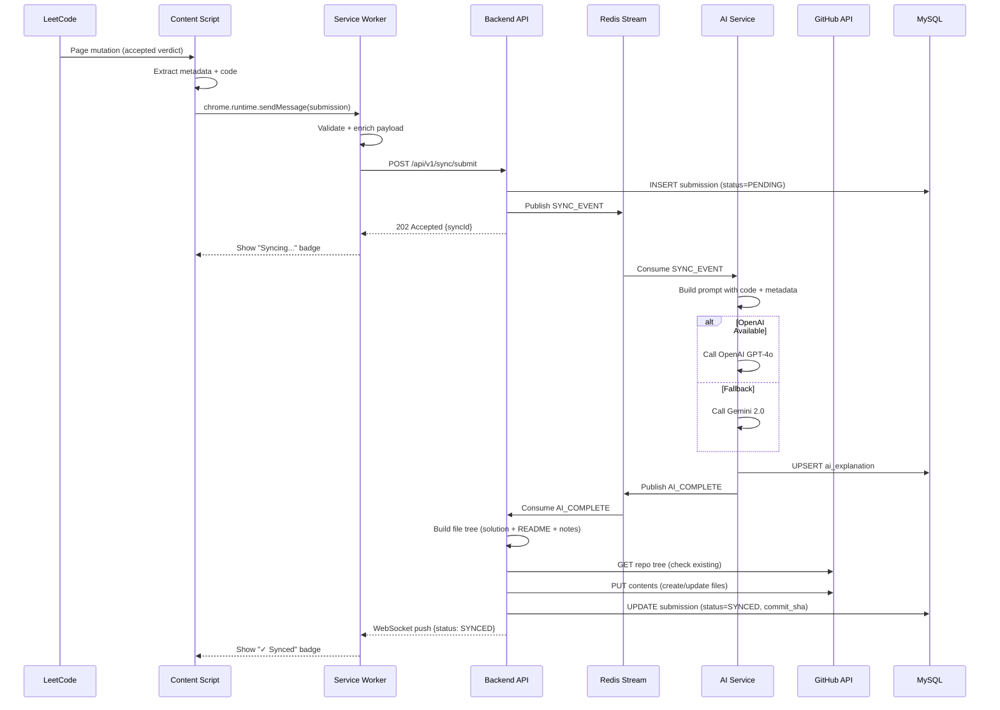

### 6.2 Authentication Flow

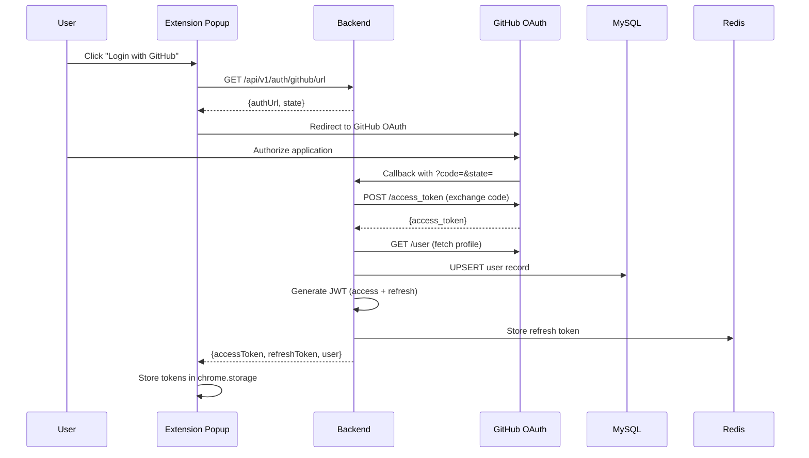

### 6.3 Analytics Query Flow

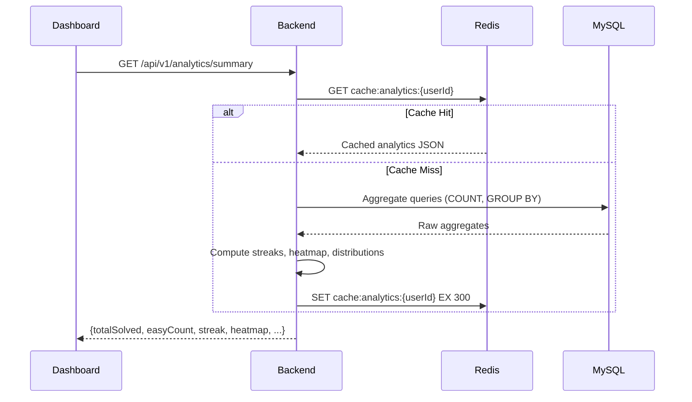

---

## 7. Database Design

### 7.1 Entity-Relationship Diagram

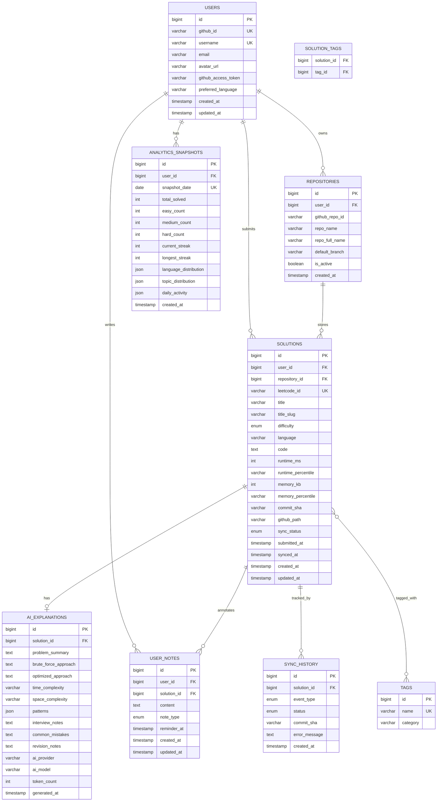

### 7.2 Table Definitions

#### `users`

| Column | Type | Constraints | Description |
|--------|------|-------------|-------------|
| `id` | BIGINT | PK, AUTO_INCREMENT | Internal user ID |
| `github_id` | VARCHAR(50) | UNIQUE, NOT NULL | GitHub user ID |
| `username` | VARCHAR(100) | UNIQUE, NOT NULL | GitHub username |
| `email` | VARCHAR(255) | | User email |
| `avatar_url` | VARCHAR(500) | | GitHub avatar |
| `github_access_token` | VARCHAR(500) | NOT NULL | Encrypted GitHub PAT |
| `preferred_language` | VARCHAR(20) | DEFAULT 'java' | Default coding language |
| `created_at` | TIMESTAMP | DEFAULT CURRENT_TIMESTAMP | |
| `updated_at` | TIMESTAMP | ON UPDATE CURRENT_TIMESTAMP | |

#### `solutions`

| Column | Type | Constraints | Description |
|--------|------|-------------|-------------|
| `id` | BIGINT | PK, AUTO_INCREMENT | |
| `user_id` | BIGINT | FK → users.id, NOT NULL | |
| `repository_id` | BIGINT | FK → repositories.id | |
| `leetcode_id` | VARCHAR(20) | NOT NULL | LeetCode problem number |
| `title` | VARCHAR(300) | NOT NULL | Problem title |
| `title_slug` | VARCHAR(300) | NOT NULL | URL-safe slug |
| `difficulty` | ENUM('EASY','MEDIUM','HARD') | NOT NULL | |
| `language` | VARCHAR(30) | NOT NULL | Submission language |
| `code` | MEDIUMTEXT | NOT NULL | Submitted source code |
| `runtime_ms` | INT | | Execution time |
| `runtime_percentile` | VARCHAR(10) | | e.g., "95.2%" |
| `memory_kb` | INT | | Memory usage |
| `memory_percentile` | VARCHAR(10) | | e.g., "87.1%" |
| `commit_sha` | VARCHAR(40) | | GitHub commit hash |
| `github_path` | VARCHAR(500) | | Path in repo |
| `sync_status` | ENUM('PENDING','SYNCING','SYNCED','FAILED') | DEFAULT 'PENDING' | |
| `submitted_at` | TIMESTAMP | NOT NULL | LeetCode submission time |
| `synced_at` | TIMESTAMP | | When synced to GitHub |
| `created_at` | TIMESTAMP | DEFAULT CURRENT_TIMESTAMP | |
| `updated_at` | TIMESTAMP | ON UPDATE CURRENT_TIMESTAMP | |

**Indexes:**
```sql
CREATE INDEX idx_solutions_user_id ON solutions(user_id);
CREATE INDEX idx_solutions_difficulty ON solutions(user_id, difficulty);
CREATE INDEX idx_solutions_sync_status ON solutions(sync_status);
CREATE INDEX idx_solutions_submitted_at ON solutions(user_id, submitted_at);
CREATE UNIQUE INDEX idx_solutions_user_leetcode ON solutions(user_id, leetcode_id, language);
CREATE FULLTEXT INDEX idx_solutions_search ON solutions(title, title_slug);
```

#### `ai_explanations`

| Column | Type | Constraints | Description |
|--------|------|-------------|-------------|
| `id` | BIGINT | PK, AUTO_INCREMENT | |
| `solution_id` | BIGINT | FK → solutions.id, UNIQUE | One explanation per solution |
| `problem_summary` | TEXT | | AI-generated summary |
| `brute_force_approach` | TEXT | | Naive approach description |
| `optimized_approach` | TEXT | | Optimal approach description |
| `time_complexity` | VARCHAR(50) | | e.g., "O(n log n)" |
| `space_complexity` | VARCHAR(50) | | e.g., "O(n)" |
| `patterns` | JSON | | Identified patterns array |
| `interview_notes` | TEXT | | Interview-focused notes |
| `common_mistakes` | TEXT | | Common pitfalls |
| `revision_notes` | TEXT | | Spaced-repetition summary |
| `ai_provider` | VARCHAR(20) | | "openai" or "gemini" |
| `ai_model` | VARCHAR(50) | | e.g., "gpt-4o" |
| `token_count` | INT | | Tokens consumed |
| `generated_at` | TIMESTAMP | | |

#### `user_notes`

| Column | Type | Constraints | Description |
|--------|------|-------------|-------------|
| `id` | BIGINT | PK, AUTO_INCREMENT | |
| `user_id` | BIGINT | FK → users.id, NOT NULL | |
| `solution_id` | BIGINT | FK → solutions.id | Nullable for general notes |
| `content` | TEXT | NOT NULL | Markdown content |
| `note_type` | ENUM('PERSONAL','MISTAKE','REVISION','INTERVIEW') | DEFAULT 'PERSONAL' | |
| `reminder_at` | TIMESTAMP | | Revision reminder date |
| `created_at` | TIMESTAMP | DEFAULT CURRENT_TIMESTAMP | |
| `updated_at` | TIMESTAMP | ON UPDATE CURRENT_TIMESTAMP | |

### 7.3 Key Relationships

| Relationship | Type | Cardinality | Cascade |
|-------------|------|-------------|---------|
| Users → Repositories | One-to-Many | 1 user : N repos | CASCADE DELETE |
| Users → Solutions | One-to-Many | 1 user : N solutions | CASCADE DELETE |
| Solutions → AI Explanations | One-to-One | 1 solution : 0..1 explanation | CASCADE DELETE |
| Solutions ↔ Tags | Many-to-Many | N solutions : M tags | CASCADE DELETE on join table |
| Solutions → Sync History | One-to-Many | 1 solution : N events | CASCADE DELETE |
| Solutions → User Notes | One-to-Many | 1 solution : N notes | SET NULL |

---

## 8. API Design

### 8.1 API Overview

**Base URL:** `https://api.leethub.ai/api/v1`
**Content Type:** `application/json`
**Authentication:** Bearer JWT (except auth endpoints)

### 8.2 Authentication APIs

#### `GET /auth/github/url` — Get OAuth Authorization URL

**Response:**
```json
{
  "authUrl": "https://github.com/login/oauth/authorize?client_id=...&scope=repo,user:email&state=abc123",
  "state": "abc123"
}
```

#### `POST /auth/github/callback` — Exchange OAuth Code for Tokens

**Request:**
```json
{
  "code": "github_oauth_code",
  "state": "abc123"
}
```

**Response** `200 OK`:
```json
{
  "accessToken": "eyJhbGciOiJSUzI1NiIs...",
  "refreshToken": "dGhpcyBpcyBhIHJlZnJlc2g...",
  "expiresIn": 3600,
  "user": {
    "id": 1,
    "username": "johndoe",
    "email": "john@example.com",
    "avatarUrl": "https://avatars.githubusercontent.com/u/12345"
  }
}
```

#### `POST /auth/refresh` — Refresh Access Token

**Request:**
```json
{
  "refreshToken": "dGhpcyBpcyBhIHJlZnJlc2g..."
}
```

**Response** `200 OK`:
```json
{
  "accessToken": "eyJhbGciOiJSUzI1NiIs...(new)",
  "expiresIn": 3600
}
```

#### `POST /auth/logout` — Invalidate Tokens

**Response** `204 No Content`

---

### 8.3 Sync APIs

#### `POST /sync/submit` — Submit Solution for Sync

**Request:**
```json
{
  "leetcodeId": "1",
  "title": "Two Sum",
  "titleSlug": "two-sum",
  "difficulty": "EASY",
  "tags": ["Array", "Hash Table"],
  "language": "java",
  "code": "class Solution {\n  public int[] twoSum(int[] nums, int target) {\n    Map<Integer, Integer> map = new HashMap<>();\n    for (int i = 0; i < nums.length; i++) {\n      int complement = target - nums[i];\n      if (map.containsKey(complement)) {\n        return new int[] { map.get(complement), i };\n      }\n      map.put(nums[i], i);\n    }\n    throw new IllegalArgumentException();\n  }\n}",
  "runtimeMs": 2,
  "runtimePercentile": "95.2%",
  "memoryKb": 42100,
  "memoryPercentile": "87.1%",
  "submittedAt": "2026-06-22T10:15:30Z"
}
```

**Response** `202 Accepted`:
```json
{
  "syncId": "sync_a1b2c3d4",
  "status": "PENDING",
  "message": "Solution queued for sync"
}
```

#### `GET /sync/status/{syncId}` — Check Sync Status

**Response** `200 OK`:
```json
{
  "syncId": "sync_a1b2c3d4",
  "status": "SYNCED",
  "commitSha": "abc123def456",
  "githubUrl": "https://github.com/johndoe/LeetCode/tree/main/Arrays/Two_Sum",
  "aiGenerated": true,
  "syncedAt": "2026-06-22T10:15:35Z"
}
```

#### `GET /sync/history` — Get Sync History

**Query Params:** `?page=0&size=20&status=SYNCED`

**Response** `200 OK`:
```json
{
  "content": [
    {
      "syncId": "sync_a1b2c3d4",
      "title": "Two Sum",
      "difficulty": "EASY",
      "language": "java",
      "status": "SYNCED",
      "syncedAt": "2026-06-22T10:15:35Z"
    }
  ],
  "page": 0,
  "size": 20,
  "totalElements": 142,
  "totalPages": 8
}
```

---

### 8.4 Problem & Solution APIs

#### `GET /problems` — List User's Solved Problems

**Query Params:** `?page=0&size=20&difficulty=EASY&tag=Array&language=java&sort=submittedAt,desc`

**Response** `200 OK`:
```json
{
  "content": [
    {
      "id": 1,
      "leetcodeId": "1",
      "title": "Two Sum",
      "difficulty": "EASY",
      "tags": ["Array", "Hash Table"],
      "language": "java",
      "runtimeMs": 2,
      "syncStatus": "SYNCED",
      "hasAiExplanation": true,
      "notesCount": 2,
      "submittedAt": "2026-06-22T10:15:30Z"
    }
  ],
  "page": 0,
  "size": 20,
  "totalElements": 142
}
```

#### `GET /problems/{id}` — Get Problem Detail with AI Explanation

**Response** `200 OK`:
```json
{
  "id": 1,
  "leetcodeId": "1",
  "title": "Two Sum",
  "difficulty": "EASY",
  "tags": ["Array", "Hash Table"],
  "language": "java",
  "code": "class Solution { ... }",
  "runtimeMs": 2,
  "runtimePercentile": "95.2%",
  "memoryKb": 42100,
  "memoryPercentile": "87.1%",
  "githubUrl": "https://github.com/johndoe/LeetCode/tree/main/Arrays/Two_Sum",
  "aiExplanation": {
    "problemSummary": "Given an array of integers and a target...",
    "bruteForceApproach": "Nested loops checking all pairs: O(n²)...",
    "optimizedApproach": "Single-pass hash map: O(n)...",
    "timeComplexity": "O(n)",
    "spaceComplexity": "O(n)",
    "patterns": ["Hash Map Lookup", "Complement Search"],
    "interviewNotes": "Clarify: can elements be reused?...",
    "commonMistakes": "Forgetting to check for duplicate indices...",
    "revisionNotes": "Key insight: store complement as key..."
  },
  "submittedAt": "2026-06-22T10:15:30Z"
}
```

---

### 8.5 Analytics APIs

#### `GET /analytics/summary` — Dashboard Summary

**Response** `200 OK`:
```json
{
  "totalSolved": 142,
  "easySolved": 50,
  "mediumSolved": 65,
  "hardSolved": 27,
  "currentStreak": 12,
  "longestStreak": 34,
  "thisWeekSolved": 7,
  "thisMonthSolved": 28
}
```

#### `GET /analytics/heatmap` — Activity Heatmap

**Query Params:** `?year=2026`

**Response** `200 OK`:
```json
{
  "year": 2026,
  "data": [
    { "date": "2026-01-01", "count": 3 },
    { "date": "2026-01-02", "count": 0 },
    { "date": "2026-01-03", "count": 5 }
  ],
  "maxCount": 8
}
```

#### `GET /analytics/languages` — Language Distribution

**Response** `200 OK`:
```json
{
  "distribution": [
    { "language": "Java", "count": 85, "percentage": 59.9 },
    { "language": "Python", "count": 40, "percentage": 28.2 },
    { "language": "C++", "count": 17, "percentage": 11.9 }
  ]
}
```

#### `GET /analytics/topics` — Topic Performance

**Response** `200 OK`:
```json
{
  "topics": [
    { "topic": "Array", "solved": 35, "total": 40, "percentage": 87.5 },
    { "topic": "Dynamic Programming", "solved": 12, "total": 30, "percentage": 40.0 },
    { "topic": "Graph", "solved": 8, "total": 20, "percentage": 40.0 }
  ]
}
```

---

### 8.6 Notes APIs

#### `POST /notes` — Create Note

**Request:**
```json
{
  "solutionId": 1,
  "content": "## Key Insight\nThe complement approach avoids nested loops. Always ask: *can I trade space for time?*",
  "noteType": "PERSONAL",
  "reminderAt": "2026-07-01T09:00:00Z"
}
```

**Response** `201 Created`:
```json
{
  "id": 42,
  "solutionId": 1,
  "content": "## Key Insight\n...",
  "noteType": "PERSONAL",
  "reminderAt": "2026-07-01T09:00:00Z",
  "createdAt": "2026-06-22T10:20:00Z"
}
```

#### `GET /notes` — List Notes

**Query Params:** `?solutionId=1&noteType=MISTAKE&page=0&size=20`

#### `PUT /notes/{id}` — Update Note

#### `DELETE /notes/{id}` — Delete Note

---

### 8.7 Search APIs

#### `GET /search` — Full-Text Search

**Query Params:** `?q=two+sum&difficulty=EASY&tags=Array,Hash+Table&pattern=Hash+Map&page=0&size=20`

**Response** `200 OK`:
```json
{
  "content": [
    {
      "id": 1,
      "title": "Two Sum",
      "difficulty": "EASY",
      "tags": ["Array", "Hash Table"],
      "patterns": ["Hash Map Lookup"],
      "language": "java",
      "matchScore": 0.95,
      "submittedAt": "2026-06-22T10:15:30Z"
    }
  ],
  "page": 0,
  "totalElements": 3,
  "query": "two sum",
  "appliedFilters": {
    "difficulty": "EASY",
    "tags": ["Array", "Hash Table"]
  }
}
```

---

### 8.8 Repository APIs

#### `GET /repositories` — List User Repositories

#### `POST /repositories/select` — Select Target Repository

**Request:**
```json
{
  "repoFullName": "johndoe/LeetCode",
  "branch": "main"
}
```

#### `GET /repositories/active` — Get Active Repository

---

### 8.9 Error Response Format

All errors follow a consistent structure:

```json
{
  "timestamp": "2026-06-22T10:15:30Z",
  "status": 422,
  "error": "Unprocessable Entity",
  "code": "SYNC_DUPLICATE",
  "message": "Solution for problem 'Two Sum' in 'java' already synced",
  "path": "/api/v1/sync/submit",
  "traceId": "abc-123-def"
}
```

### 8.10 API Summary Table

| Method | Endpoint | Auth | Rate Limit | Description |
|--------|----------|------|------------|-------------|
| GET | `/auth/github/url` | No | 10/min | Get OAuth URL |
| POST | `/auth/github/callback` | No | 10/min | Exchange code |
| POST | `/auth/refresh` | No | 20/min | Refresh token |
| POST | `/auth/logout` | Yes | 10/min | Logout |
| POST | `/sync/submit` | Yes | 30/min | Submit solution |
| GET | `/sync/status/{id}` | Yes | 60/min | Sync status |
| GET | `/sync/history` | Yes | 30/min | Sync history |
| GET | `/problems` | Yes | 60/min | List problems |
| GET | `/problems/{id}` | Yes | 60/min | Problem detail |
| GET | `/analytics/summary` | Yes | 30/min | Dashboard stats |
| GET | `/analytics/heatmap` | Yes | 10/min | Activity heatmap |
| GET | `/analytics/languages` | Yes | 30/min | Language stats |
| GET | `/analytics/topics` | Yes | 30/min | Topic stats |
| POST | `/notes` | Yes | 30/min | Create note |
| GET | `/notes` | Yes | 60/min | List notes |
| PUT | `/notes/{id}` | Yes | 30/min | Update note |
| DELETE | `/notes/{id}` | Yes | 30/min | Delete note |
| GET | `/search` | Yes | 60/min | Search |
| GET | `/repositories` | Yes | 20/min | List repos |
| POST | `/repositories/select` | Yes | 10/min | Select repo |

---

## 9. Security Architecture

### 9.1 Security Architecture Diagram

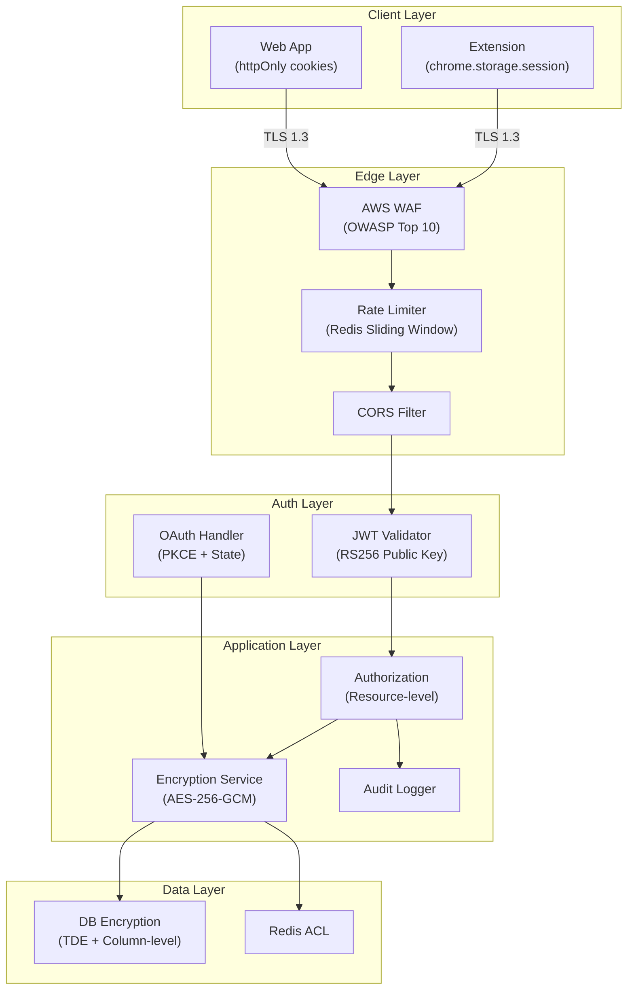

### 9.2 Authentication Design

| Aspect | Design | Detail |
|--------|--------|--------|
| **OAuth Provider** | GitHub OAuth 2.0 | Scopes: `repo`, `user:email` |
| **PKCE** | Enabled | Prevents authorization code interception |
| **State Parameter** | Cryptographic random | CSRF protection on OAuth flow |
| **Access Token** | JWT (RS256) | 1-hour expiry, signed with RSA-2048 private key |
| **Refresh Token** | Opaque, server-stored | 30-day expiry, stored in Redis with user binding |
| **Token Rotation** | Enabled | Refresh token is single-use; new one issued on refresh |
| **Extension Storage** | `chrome.storage.session` | Auto-cleared on browser close; encrypted in memory |
| **Web Storage** | httpOnly, Secure, SameSite=Strict cookies | XSS-proof token storage |

### 9.3 JWT Claims Structure

```json
{
  "sub": "user_12345",
  "iss": "leethub.ai",
  "aud": "leethub-api",
  "iat": 1719043200,
  "exp": 1719046800,
  "roles": ["USER"],
  "github_id": "12345",
  "username": "johndoe"
}
```

### 9.4 Encryption Strategy

| Data | At Rest | In Transit |
|------|---------|------------|
| GitHub Access Tokens | AES-256-GCM (application-level) | TLS 1.3 |
| User PII (email) | AES-256-GCM | TLS 1.3 |
| Solution Code | Plaintext (user's own code) | TLS 1.3 |
| JWT Signing Key | AWS Secrets Manager | N/A |
| Database | MySQL TDE | TLS 1.3 to RDS |
| Redis | Redis ACL + TLS | TLS to ElastiCache |

### 9.5 Rate Limiting Strategy

```
Sliding Window algorithm using Redis:

Key: rate_limit:{user_id}:{endpoint}:{window}
Window: 60 seconds
Algorithm: 
  1. ZADD with current timestamp as score
  2. ZREMRANGEBYSCORE to remove expired entries
  3. ZCARD to count current window
  4. Compare against limit

Headers returned:
  X-RateLimit-Limit: 60
  X-RateLimit-Remaining: 45
  X-RateLimit-Reset: 1719043260
```

### 9.6 Additional Security Measures

| Measure | Implementation |
|---------|---------------|
| **Input Validation** | Jakarta Bean Validation on all DTOs; parameterized SQL queries |
| **SQL Injection** | JPA/Hibernate parameterized queries exclusively |
| **XSS Prevention** | React's built-in escaping; CSP headers on web app |
| **CSRF** | SameSite cookies + CSRF tokens for state-changing ops |
| **Dependency Scanning** | GitHub Dependabot + OWASP Dependency-Check in CI |
| **Secret Management** | AWS Secrets Manager; no secrets in code/env files |
| **Audit Logging** | All auth events and data access logged with user context |
| **Content Security Policy** | `default-src 'self'; script-src 'self'; style-src 'self' 'unsafe-inline'` |

---

## 10. Scalability Strategy

### 10.1 Caching Architecture

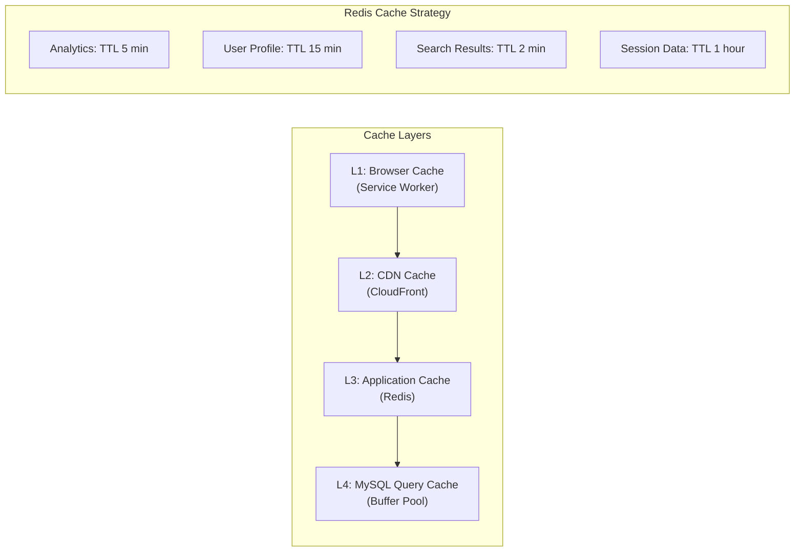

| Cache Target | TTL | Invalidation Strategy | Estimated Hit Rate |
|-------------|-----|----------------------|-------------------|
| Analytics Summary | 5 min | Event-driven on new sync | 85% |
| Heatmap Data | 1 hour | Daily rebuild | 95% |
| User Profile | 15 min | On profile update | 90% |
| Search Results | 2 min | On new solution | 60% |
| Repository List | 10 min | On repo selection change | 95% |

### 10.2 Async Processing Design

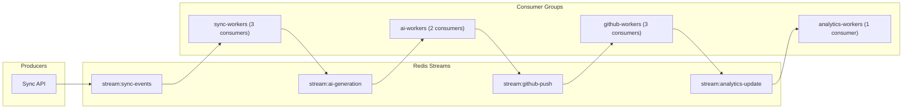

**Processing Pipeline:**

1. **Sync Event** → Validate + persist submission
2. **AI Generation** → Call LLM API, store explanation (slowest step, ~5-8s)
3. **GitHub Push** → Build file tree, commit via GitHub API
4. **Analytics Update** → Invalidate cache, update snapshots

**Retry Policy:**

| Stage | Max Retries | Backoff | Dead Letter |
|-------|------------|---------|-------------|
| AI Generation | 3 | Exponential (2s, 4s, 8s) | `stream:ai-dlq` |
| GitHub Push | 5 | Exponential (1s, 2s, 4s, 8s, 16s) | `stream:github-dlq` |
| Analytics | 3 | Fixed (5s) | `stream:analytics-dlq` |

### 10.3 Database Optimization

| Strategy | Implementation | Impact |
|----------|---------------|--------|
| **Connection Pooling** | HikariCP (min=5, max=20) | Reduce connection overhead |
| **Read Replicas** | MySQL read replica for analytics/search | Offload read traffic |
| **Indexing** | Composite indexes on frequent query patterns | Sub-10ms query times |
| **Partitioning** | Range partition `solutions` by `submitted_at` (yearly) | Efficient archival, faster scans |
| **Query Optimization** | Explain-analyze all queries > 100ms | CI gate |
| **Pagination** | Keyset (cursor-based) for large datasets | O(1) vs O(n) offset |

### 10.4 Horizontal Scaling Path

```
Phase 1 (0-10K users):
  Single instance, modular monolith
  ↓
Phase 2 (10K-100K users):
  2-3 instances behind ALB, read replica
  ↓  
Phase 3 (100K+ users):
  Extract AI Service → separate deployment
  Extract Sync Service → separate deployment
  Add Elasticsearch for search
  ↓
Phase 4 (1M+ users):
  Full microservices with service mesh
  Sharded database
  Multi-region deployment
```

---

## 11. Development Roadmap

### 11.1 Phase Overview

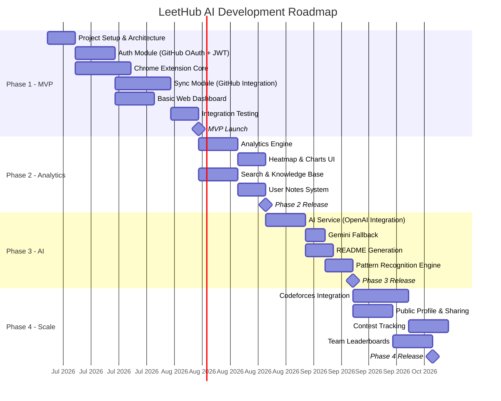

### 11.2 Phase Details

#### Phase 1: MVP (Weeks 1–8)

| Deliverable | Duration | Dependencies | Definition of Done |
|-------------|----------|--------------|-------------------|
| Project scaffolding | 1 week | None | Repos created, CI/CD green, Docker builds |
| GitHub OAuth + JWT auth | 1.5 weeks | Scaffolding | Login/logout, token refresh, extension auth |
| Extension content script | 2 weeks | Scaffolding | Detects accepted submissions on LeetCode |
| Extension service worker | 1 week | Content script, Auth | Queues submissions, calls backend |
| Sync module | 2 weeks | Auth | Files committed to GitHub successfully |
| Basic dashboard | 1.5 weeks | Auth | Login, problem list, sync status |
| Integration testing | 1 week | All above | E2E flow passes |

#### Phase 2: Analytics & Knowledge (Weeks 9–14)

| Deliverable | Duration | Dependencies |
|-------------|----------|--------------|
| Analytics aggregation engine | 1.5 weeks | Phase 1 |
| Heatmap visualization | 1 week | Analytics engine |
| Charts (language, topic, trend) | 1 week | Analytics engine |
| Full-text search | 1.5 weeks | Phase 1 |
| User notes CRUD | 1 week | Phase 1 |

#### Phase 3: AI Features (Weeks 15–20)

| Deliverable | Duration | Dependencies |
|-------------|----------|--------------|
| OpenAI integration + prompt engineering | 1.5 weeks | Phase 1 |
| Gemini fallback + provider abstraction | 1 week | OpenAI integration |
| README.md generation | 1 week | AI service |
| Pattern recognition | 1 week | AI service |
| Revision notes generation | 0.5 weeks | AI service |

#### Phase 4: Multi-Platform (Weeks 21–30)

| Deliverable | Duration | Dependencies |
|-------------|----------|--------------|
| Platform abstraction layer | 1 week | Phase 3 |
| Codeforces integration | 2 weeks | Abstraction layer |
| Public profile pages | 1.5 weeks | Phase 2 |
| Contest tracking | 1.5 weeks | Codeforces |
| Team leaderboards | 1.5 weeks | Public profiles |
| Resume generation | 2 weeks | All analytics |

---

## 12. Folder Structure

### 12.1 Backend (Spring Boot)

```
leethub-backend/
├── .github/
│   └── workflows/
│       ├── ci.yml
│       ├── cd-staging.yml
│       └── cd-production.yml
├── docker/
│   ├── Dockerfile
│   ├── docker-compose.yml
│   └── docker-compose.dev.yml
├── docs/
│   ├── api/
│   │   └── openapi.yaml
│   └── architecture/
│       └── SAD.md
├── src/
│   ├── main/
│   │   ├── java/
│   │   │   └── com/leethubai/
│   │   │       ├── LeetHubApplication.java
│   │   │       ├── common/
│   │   │       │   ├── config/
│   │   │       │   │   ├── SecurityConfig.java
│   │   │       │   │   ├── RedisConfig.java
│   │   │       │   │   ├── CorsConfig.java
│   │   │       │   │   ├── JacksonConfig.java
│   │   │       │   │   └── AsyncConfig.java
│   │   │       │   ├── dto/
│   │   │       │   │   ├── ApiResponse.java
│   │   │       │   │   ├── ApiError.java
│   │   │       │   │   └── PagedResponse.java
│   │   │       │   ├── exception/
│   │   │       │   │   ├── GlobalExceptionHandler.java
│   │   │       │   │   ├── ResourceNotFoundException.java
│   │   │       │   │   ├── SyncException.java
│   │   │       │   │   └── RateLimitExceededException.java
│   │   │       │   ├── security/
│   │   │       │   │   ├── JwtTokenProvider.java
│   │   │       │   │   ├── JwtAuthenticationFilter.java
│   │   │       │   │   ├── UserPrincipal.java
│   │   │       │   │   └── EncryptionService.java
│   │   │       │   └── util/
│   │   │       │       ├── SlugUtils.java
│   │   │       │       └── DateUtils.java
│   │   │       ├── auth/
│   │   │       │   ├── controller/
│   │   │       │   │   └── AuthController.java
│   │   │       │   ├── service/
│   │   │       │   │   ├── AuthService.java
│   │   │       │   │   └── GitHubOAuthService.java
│   │   │       │   ├── dto/
│   │   │       │   │   ├── OAuthCallbackRequest.java
│   │   │       │   │   ├── TokenResponse.java
│   │   │       │   │   └── UserResponse.java
│   │   │       │   └── repository/
│   │   │       │       └── UserRepository.java
│   │   │       ├── sync/
│   │   │       │   ├── controller/
│   │   │       │   │   └── SyncController.java
│   │   │       │   ├── service/
│   │   │       │   │   ├── SyncService.java
│   │   │       │   │   ├── GitHubSyncService.java
│   │   │       │   │   └── FileTreeBuilder.java
│   │   │       │   ├── dto/
│   │   │       │   │   ├── SubmitRequest.java
│   │   │       │   │   ├── SyncStatusResponse.java
│   │   │       │   │   └── SyncHistoryResponse.java
│   │   │       │   ├── model/
│   │   │       │   │   ├── Solution.java
│   │   │       │   │   ├── SyncHistory.java
│   │   │       │   │   └── SyncStatus.java
│   │   │       │   ├── repository/
│   │   │       │   │   ├── SolutionRepository.java
│   │   │       │   │   └── SyncHistoryRepository.java
│   │   │       │   └── event/
│   │   │       │       ├── SyncEventPublisher.java
│   │   │       │       └── SyncEventConsumer.java
│   │   │       ├── ai/
│   │   │       │   ├── controller/
│   │   │       │   │   └── AiController.java
│   │   │       │   ├── service/
│   │   │       │   │   ├── AiService.java
│   │   │       │   │   ├── OpenAiProvider.java
│   │   │       │   │   ├── GeminiProvider.java
│   │   │       │   │   ├── AiProviderFactory.java
│   │   │       │   │   └── PromptTemplateService.java
│   │   │       │   ├── dto/
│   │   │       │   │   └── AiExplanationResponse.java
│   │   │       │   ├── model/
│   │   │       │   │   ├── AiExplanation.java
│   │   │       │   │   └── AiProvider.java
│   │   │       │   └── repository/
│   │   │       │       └── AiExplanationRepository.java
│   │   │       ├── analytics/
│   │   │       │   ├── controller/
│   │   │       │   │   └── AnalyticsController.java
│   │   │       │   ├── service/
│   │   │       │   │   ├── AnalyticsService.java
│   │   │       │   │   ├── StreakCalculator.java
│   │   │       │   │   └── HeatmapGenerator.java
│   │   │       │   ├── dto/
│   │   │       │   │   ├── SummaryResponse.java
│   │   │       │   │   ├── HeatmapResponse.java
│   │   │       │   │   ├── LanguageDistResponse.java
│   │   │       │   │   └── TopicPerfResponse.java
│   │   │       │   └── repository/
│   │   │       │       └── AnalyticsSnapshotRepository.java
│   │   │       ├── search/
│   │   │       │   ├── controller/
│   │   │       │   │   └── SearchController.java
│   │   │       │   ├── service/
│   │   │       │   │   └── SearchService.java
│   │   │       │   └── dto/
│   │   │       │       └── SearchResponse.java
│   │   │       ├── notes/
│   │   │       │   ├── controller/
│   │   │       │   │   └── NotesController.java
│   │   │       │   ├── service/
│   │   │       │   │   └── NotesService.java
│   │   │       │   ├── dto/
│   │   │       │   │   ├── CreateNoteRequest.java
│   │   │       │   │   └── NoteResponse.java
│   │   │       │   ├── model/
│   │   │       │   │   ├── UserNote.java
│   │   │       │   │   └── NoteType.java
│   │   │       │   └── repository/
│   │   │       │       └── UserNoteRepository.java
│   │   │       └── repository/
│   │   │           ├── controller/
│   │   │           │   └── RepositoryController.java
│   │   │           ├── service/
│   │   │           │   └── RepositoryService.java
│   │   │           ├── model/
│   │   │           │   └── Repository.java
│   │   │           └── repository/
│   │   │               └── RepositoryRepository.java
│   │   └── resources/
│   │       ├── application.yml
│   │       ├── application-dev.yml
│   │       ├── application-prod.yml
│   │       ├── db/migration/
│   │       │   ├── V1__create_users_table.sql
│   │       │   ├── V2__create_repositories_table.sql
│   │       │   ├── V3__create_solutions_table.sql
│   │       │   ├── V4__create_ai_explanations_table.sql
│   │       │   ├── V5__create_tags_tables.sql
│   │       │   ├── V6__create_user_notes_table.sql
│   │       │   ├── V7__create_analytics_snapshots_table.sql
│   │       │   └── V8__create_sync_history_table.sql
│   │       └── prompts/
│   │           ├── explanation_prompt.txt
│   │           └── pattern_prompt.txt
│   └── test/
│       └── java/
│           └── com/leethubai/
│               ├── auth/
│               │   ├── AuthControllerTest.java
│               │   └── AuthServiceTest.java
│               ├── sync/
│               │   ├── SyncControllerTest.java
│               │   ├── SyncServiceTest.java
│               │   └── GitHubSyncServiceTest.java
│               ├── ai/
│               │   └── AiServiceTest.java
│               ├── analytics/
│               │   └── AnalyticsServiceTest.java
│               └── integration/
│                   ├── SyncFlowIntegrationTest.java
│                   └── AuthFlowIntegrationTest.java
├── build.gradle
├── settings.gradle
├── gradle.properties
├── .env.example
├── .gitignore
└── README.md
```

### 12.2 Frontend (React + TypeScript + Tailwind)

```
leethub-frontend/
├── public/
│   ├── index.html
│   ├── favicon.ico
│   └── manifest.json
├── src/
│   ├── main.tsx
│   ├── App.tsx
│   ├── vite-env.d.ts
│   ├── api/
│   │   ├── axiosClient.ts
│   │   ├── authApi.ts
│   │   ├── syncApi.ts
│   │   ├── analyticsApi.ts
│   │   ├── problemsApi.ts
│   │   ├── notesApi.ts
│   │   └── searchApi.ts
│   ├── components/
│   │   ├── layout/
│   │   │   ├── Sidebar.tsx
│   │   │   ├── Header.tsx
│   │   │   ├── Footer.tsx
│   │   │   └── Layout.tsx
│   │   ├── dashboard/
│   │   │   ├── StatsCards.tsx
│   │   │   ├── Heatmap.tsx
│   │   │   ├── StreakCounter.tsx
│   │   │   ├── LanguageChart.tsx
│   │   │   └── TopicRadar.tsx
│   │   ├── problems/
│   │   │   ├── ProblemList.tsx
│   │   │   ├── ProblemCard.tsx
│   │   │   ├── ProblemDetail.tsx
│   │   │   ├── CodeViewer.tsx
│   │   │   └── AiExplanation.tsx
│   │   ├── search/
│   │   │   ├── SearchBar.tsx
│   │   │   ├── FilterPanel.tsx
│   │   │   └── SearchResults.tsx
│   │   ├── notes/
│   │   │   ├── NoteEditor.tsx
│   │   │   ├── NoteList.tsx
│   │   │   └── NoteCard.tsx
│   │   ├── auth/
│   │   │   ├── LoginButton.tsx
│   │   │   ├── OAuthCallback.tsx
│   │   │   └── ProtectedRoute.tsx
│   │   └── common/
│   │       ├── Button.tsx
│   │       ├── Badge.tsx
│   │       ├── Modal.tsx
│   │       ├── Loader.tsx
│   │       ├── Toast.tsx
│   │       └── EmptyState.tsx
│   ├── hooks/
│   │   ├── useAuth.ts
│   │   ├── useAnalytics.ts
│   │   ├── useProblems.ts
│   │   ├── useNotes.ts
│   │   ├── useSearch.ts
│   │   └── useDebounce.ts
│   ├── context/
│   │   ├── AuthContext.tsx
│   │   └── ThemeContext.tsx
│   ├── pages/
│   │   ├── DashboardPage.tsx
│   │   ├── ProblemsPage.tsx
│   │   ├── ProblemDetailPage.tsx
│   │   ├── SearchPage.tsx
│   │   ├── NotesPage.tsx
│   │   ├── SettingsPage.tsx
│   │   ├── LoginPage.tsx
│   │   └── OAuthCallbackPage.tsx
│   ├── types/
│   │   ├── auth.ts
│   │   ├── problem.ts
│   │   ├── analytics.ts
│   │   ├── note.ts
│   │   └── api.ts
│   ├── utils/
│   │   ├── constants.ts
│   │   ├── formatters.ts
│   │   └── validators.ts
│   └── styles/
│       └── globals.css
├── tailwind.config.ts
├── tsconfig.json
├── vite.config.ts
├── package.json
├── .env.example
├── .gitignore
└── README.md
```

### 12.3 Browser Extension (Manifest V3)

```
leethub-extension/
├── public/
│   ├── manifest.json
│   ├── icons/
│   │   ├── icon16.png
│   │   ├── icon32.png
│   │   ├── icon48.png
│   │   └── icon128.png
│   └── _locales/
│       └── en/
│           └── messages.json
├── src/
│   ├── background/
│   │   ├── serviceWorker.ts
│   │   ├── syncManager.ts
│   │   ├── authManager.ts
│   │   ├── offlineQueue.ts
│   │   └── alarmHandler.ts
│   ├── content/
│   │   ├── contentScript.ts
│   │   ├── leetcodeDetector.ts
│   │   ├── domObserver.ts
│   │   ├── metadataExtractor.ts
│   │   ├── codeExtractor.ts
│   │   └── submissionParser.ts
│   ├── popup/
│   │   ├── Popup.tsx
│   │   ├── components/
│   │   │   ├── LoginView.tsx
│   │   │   ├── SyncStatus.tsx
│   │   │   ├── HistoryList.tsx
│   │   │   ├── SettingsView.tsx
│   │   │   └── StatusBadge.tsx
│   │   ├── hooks/
│   │   │   └── useExtensionAuth.ts
│   │   └── popup.html
│   ├── shared/
│   │   ├── types.ts
│   │   ├── constants.ts
│   │   ├── messages.ts
│   │   └── storage.ts
│   └── utils/
│       ├── encryption.ts
│       ├── logger.ts
│       └── retry.ts
├── webpack.config.js
├── tsconfig.json
├── package.json
├── .gitignore
└── README.md
```

---

## 13. Deployment Architecture

### 13.1 Infrastructure Diagram

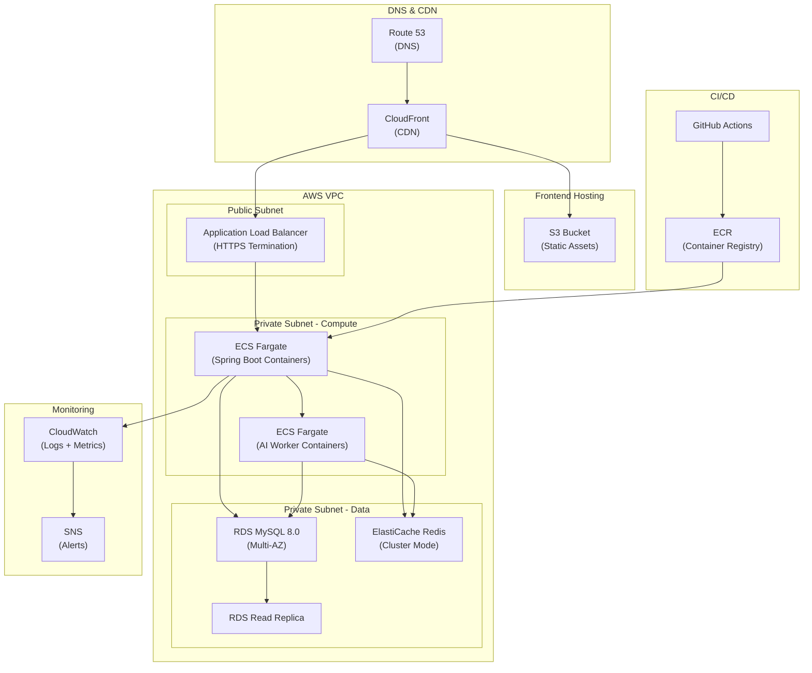

### 13.2 Docker Configuration

**Backend Dockerfile:**

```dockerfile
# Build stage
FROM eclipse-temurin:21-jdk-alpine AS build
WORKDIR /app
COPY gradle/ gradle/
COPY gradlew build.gradle settings.gradle ./
RUN ./gradlew dependencies --no-daemon
COPY src/ src/
RUN ./gradlew bootJar --no-daemon

# Runtime stage
FROM eclipse-temurin:21-jre-alpine
RUN addgroup -S app && adduser -S app -G app
WORKDIR /app
COPY --from=build /app/build/libs/*.jar app.jar
USER app
EXPOSE 8080
HEALTHCHECK --interval=30s CMD wget -qO- http://localhost:8080/actuator/health || exit 1
ENTRYPOINT ["java", "-XX:+UseG1GC", "-XX:MaxRAMPercentage=75", "-jar", "app.jar"]
```

**Docker Compose (Development):**

```yaml
version: '3.9'
services:
  backend:
    build: ./leethub-backend
    ports: ["8080:8080"]
    environment:
      SPRING_PROFILES_ACTIVE: dev
      SPRING_DATASOURCE_URL: jdbc:mysql://mysql:3306/leethub
      SPRING_REDIS_HOST: redis
    depends_on:
      mysql: { condition: service_healthy }
      redis: { condition: service_healthy }

  mysql:
    image: mysql:8.0
    ports: ["3306:3306"]
    environment:
      MYSQL_ROOT_PASSWORD: devpassword
      MYSQL_DATABASE: leethub
    volumes: ["mysql_data:/var/lib/mysql"]
    healthcheck:
      test: ["CMD", "mysqladmin", "ping", "-h", "localhost"]

  redis:
    image: redis:7-alpine
    ports: ["6379:6379"]
    healthcheck:
      test: ["CMD", "redis-cli", "ping"]

volumes:
  mysql_data:
```

### 13.3 CI/CD Pipeline

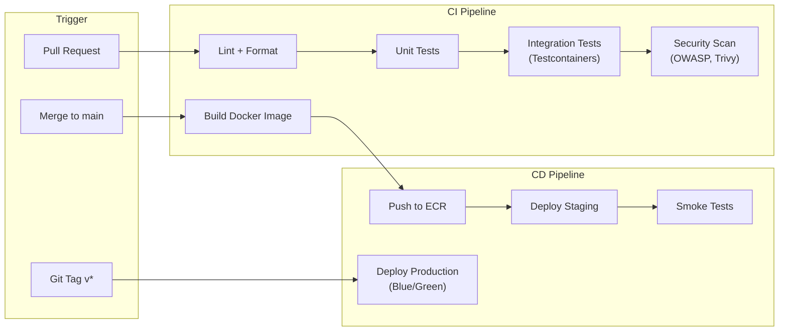

**GitHub Actions Workflow Summary:**

| Workflow | Trigger | Steps |
|----------|---------|-------|
| `ci.yml` | PR to `main` | Lint → Unit Test → Integration Test → OWASP Scan → Build |
| `cd-staging.yml` | Push to `main` | Build Image → Push ECR → Deploy ECS Staging → Smoke Tests |
| `cd-production.yml` | Git tag `v*` | Blue/Green deploy to ECS Production → Health check → DNS cutover |

### 13.4 Environment Strategy

| Environment | Purpose | Infrastructure | Data |
|-------------|---------|---------------|------|
| **Local** | Developer machine | Docker Compose | Seeded test data |
| **CI** | Automated testing | GitHub Actions runners | Testcontainers (ephemeral) |
| **Staging** | Pre-production validation | AWS (reduced capacity) | Sanitized production clone |
| **Production** | Live users | AWS (full capacity, Multi-AZ) | Real user data |

### 13.5 Cost Estimate (AWS — Startup Scale)

| Service | Spec | Monthly Cost (est.) |
|---------|------|-------------------|
| ECS Fargate (API) | 2 tasks × 0.5 vCPU, 1 GB | $30 |
| ECS Fargate (AI Worker) | 1 task × 0.5 vCPU, 1 GB | $15 |
| RDS MySQL | db.t3.medium, 50 GB | $50 |
| ElastiCache Redis | cache.t3.micro | $15 |
| S3 + CloudFront | Static hosting | $5 |
| ALB | Standard | $20 |
| ECR | Image storage | $5 |
| **Total** | | **~$140/month** |

> [!TIP]
> For early-stage development or hackathons, consider **Render.com** as an alternative — it offers free-tier PostgreSQL (swap MySQL for PostgreSQL) and web services with simpler deployment, reducing cost to near $0 during prototyping.

---

## 14. Risk Analysis

### 14.1 Risk Matrix

| ID | Risk | Probability | Impact | Severity | Mitigation |
|----|------|-------------|--------|----------|------------|
| R1 | **LeetCode DOM changes break detection** | High | High | 🔴 Critical | Multi-strategy detection (DOM + XHR + GraphQL); automated regression tests against LeetCode; version-pinned selectors with quick-patch release pipeline |
| R2 | **GitHub API rate limiting** | Medium | High | 🟠 High | Batch commits (tree API), request queuing with backoff, authenticated requests (5,000/hr), cache repo metadata |
| R3 | **AI API costs escalate** | Medium | Medium | 🟡 Medium | Token budget per user, caching identical problems, prompt optimization, Gemini as cheaper fallback, user-configurable AI toggle |
| R4 | **AI generates incorrect explanations** | Medium | Medium | 🟡 Medium | Structured prompts with chain-of-thought, temperature=0.2, user feedback mechanism, human-review flag for edge cases |
| R5 | **GitHub token compromise** | Low | Critical | 🔴 Critical | AES-256 encryption at rest, minimum scope (`repo` only), token rotation, audit logging, breach detection alerts |
| R6 | **Chrome Manifest V3 limitations** | Medium | Medium | 🟡 Medium | Service worker lifecycle management, alarm-based keepalive, offscreen documents for complex processing |
| R7 | **Database performance degradation** | Low | High | 🟠 High | Indexing strategy, query monitoring, read replicas, partitioning, connection pooling |
| R8 | **User data loss during sync failure** | Low | High | 🟠 High | Idempotent sync operations, retry with exponential backoff, local queue persistence, sync status tracking |
| R9 | **OpenAI/Gemini API downtime** | Low | Medium | 🟡 Medium | Dual-provider with automatic fallback, graceful degradation (sync without AI), queue for retry |
| R10 | **Chrome Web Store rejection** | Medium | High | 🟠 High | Strict MV3 compliance, minimal permissions, clear privacy policy, remote code prohibition |

### 14.2 Risk Severity Legend

| Severity | Action |
|----------|--------|
| 🔴 Critical | Must mitigate before launch |
| 🟠 High | Mitigate within Phase 1 |
| 🟡 Medium | Monitor and address in Phase 2 |
| 🟢 Low | Accept and monitor |

### 14.3 Contingency Plans

| Scenario | Response |
|----------|----------|
| LeetCode blocks extension | Switch to clipboard-based manual submission; explore API-less approaches |
| AI costs exceed budget | Default to Gemini Flash (cheapest); offer AI as premium feature |
| GitHub changes OAuth policy | Support GitHub Apps as alternative auth mechanism |
| Single-user data breach | Automated token revocation, user notification within 24h, incident report |

---

## 15. Future Enhancements

### 15.1 Startup-Scale Roadmap

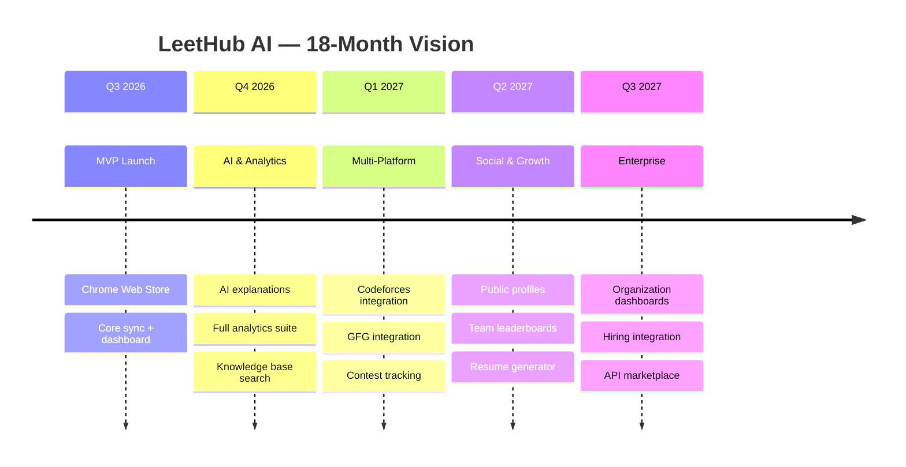

### 15.2 Feature Expansion Details

#### Multi-Platform Integration

| Platform | Detection Strategy | Priority | Complexity |
|----------|-------------------|----------|------------|
| **Codeforces** | DOM mutation + `/status` page scraping | P1 | Medium |
| **GeeksforGeeks** | DOM observer on submission verdict | P2 | Medium |
| **HackerRank** | Network request interception | P2 | High (SPA) |
| **CodingNinjas** | DOM observer | P3 | Medium |

**Architecture:** Plugin-based platform abstraction:
```
interface PlatformDetector {
  detectSubmission(): Submission | null
  extractMetadata(): ProblemMetadata
  extractCode(): string
  getPlatformName(): string
}
```

#### Contest Tracking

- Real-time contest reminders (calendar integration)
- Contest performance analytics (rating trends, percentile)
- Contest solution auto-sync with time-stamped commits
- Virtual contest mode tracking

#### Resume Generation

- Auto-generate LaTeX/PDF resume from solve history
- Highlight strongest topics and patterns
- Include GitHub contribution stats
- Customizable templates (FAANG, startup, academic)

#### Public Profile & Sharing

- Shareable URL (`leethub.ai/@username`)
- Customizable public dashboard
- Embeddable widgets (for personal websites/portfolios)
- Social sharing (Twitter/LinkedIn cards)

#### Team & Organization Features

- Team creation and management
- Shared problem lists and study plans
- Competitive leaderboards (weekly/monthly)
- Organization dashboards for hiring managers
- Interview prep group tracking

#### Advanced AI Features

- **Code Review:** AI-powered code quality feedback
- **Alternative Solutions:** Generate solutions in different languages
- **Hint System:** Progressive hints for unsolved problems
- **Spaced Repetition:** SM-2 algorithm-based revision scheduling
- **Mock Interview:** AI-driven mock interview with follow-up questions

### 15.3 Monetization Strategy (Future)

| Tier | Price | Features |
|------|-------|----------|
| **Free** | $0 | Sync ≤ 50 problems/month, basic analytics, community support |
| **Pro** | $5/month | Unlimited sync, full AI explanations, advanced analytics, priority support |
| **Team** | $3/user/month | Pro + team leaderboards, shared study plans, admin dashboard |
| **Enterprise** | Custom | Team + SSO, hiring integrations, dedicated support, SLA |

---

## Appendix A: Glossary

| Term | Definition |
|------|-----------|
| **MV3** | Chrome Extension Manifest V3, the latest extension platform |
| **Service Worker** | Background script in MV3 (replaces persistent background pages) |
| **Content Script** | JavaScript injected into web pages by the extension |
| **PKCE** | Proof Key for Code Exchange — OAuth security extension |
| **JWT** | JSON Web Token — stateless authentication token |
| **TDE** | Transparent Data Encryption — database-level encryption |
| **DLQ** | Dead Letter Queue — failed message storage for investigation |
| **SM-2** | SuperMemo 2 — spaced repetition scheduling algorithm |

## Appendix B: References

| # | Reference | URL |
|---|-----------|-----|
| 1 | Chrome MV3 Migration Guide | https://developer.chrome.com/docs/extensions/develop/migrate |
| 2 | GitHub REST API v3 | https://docs.github.com/en/rest |
| 3 | GitHub GraphQL API v4 | https://docs.github.com/en/graphql |
| 4 | OpenAI API Reference | https://platform.openai.com/docs/api-reference |
| 5 | Gemini API Documentation | https://ai.google.dev/docs |
| 6 | Spring Boot 3.x Reference | https://docs.spring.io/spring-boot/docs/current/reference/html |
| 7 | Redis Streams Documentation | https://redis.io/docs/data-types/streams |
| 8 | AWS ECS Best Practices | https://docs.aws.amazon.com/AmazonECS/latest/bestpracticesguide |

---

*Document generated: June 22, 2026 • Version 1.0.0 • Status: Draft — Pending Review*
